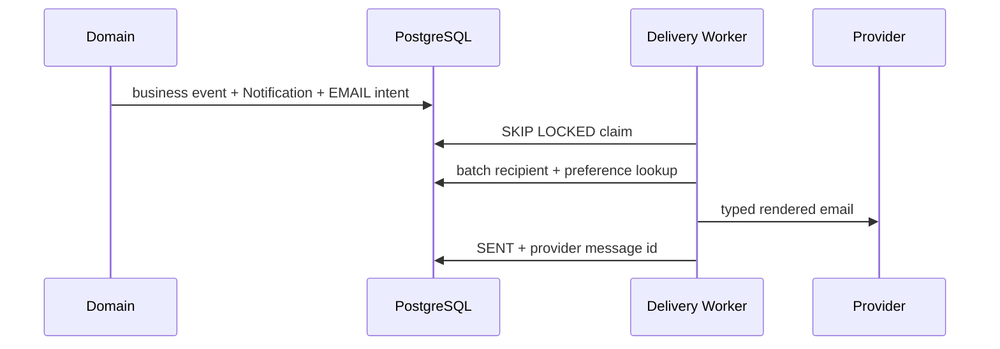
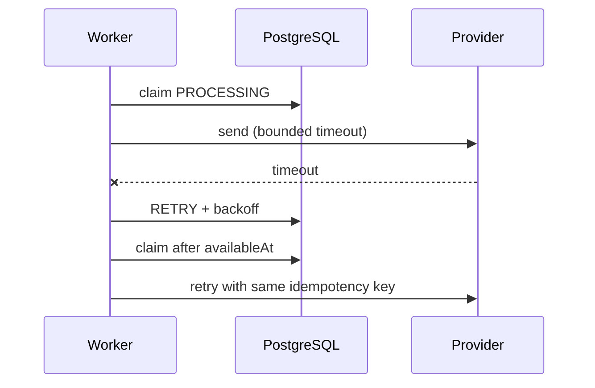

# Account and email delivery

## Overview

Account self-service is exposed through the `/api/v1/me` application boundary.
Users owns profile state, Auth owns credentials/action tokens/logical sessions,
Notifications owns in-app events, and Email Delivery owns typed preferences,
channel intent, templates and provider execution. These remain modules in the
same monolith. PostgreSQL is authoritative for every security and delivery state.

## Profile

`GET /me/profile` returns `id`, `displayName`, current email verification state
and an optional pending email change. `PATCH /me/profile` accepts only a trimmed
Unicode `displayName` of 1–100 characters. Email is excluded from this mutation;
public seller projections read the User record rather than copying the name to
every Listing.

## Email change

`POST /me/email-change/request` requires the active session, a canonical new
email and the current password. The transaction rechecks the credential and
session, rejects an existing canonical owner, replaces any prior EMAIL_CHANGE
token, stores only its digest and binds the token to the target email and current
session. The old email remains active until confirmation.

`POST /auth/email-change/confirm` locks the user and token, checks ACTIVE status,
single use and expiry, rechecks uniqueness, then changes the email, marks it
verified, consumes the token and revokes every session except the session that
requested the change. A mandatory security email is scheduled to the old-address
snapshot. Unique database enforcement resolves concurrent confirmation races.

```mermaid
sequenceDiagram
  actor User
  participant Web as Frontend
  participant API
  participant DB as PostgreSQL
  participant Worker as Delivery Worker
  participant Provider as Email Provider
  User->>Web: new email + current password
  Web->>API: POST /me/email-change/request
  API->>DB: verify password/session; token digest + delivery
  Worker->>DB: claim confirmation delivery
  Worker->>Provider: confirmation link
  User->>Web: open link and confirm
  Web->>API: POST /auth/email-change/confirm
  API->>DB: change email; consume token; revoke other sessions
```

## Password

The existing `/auth/password/change` remains authoritative. The security page
adds current/new/confirmation UX. A successful change preserves the current
logical session, revokes the others and invalidates outstanding reset links.
Password reset continues to revoke every session.

## Sessions

`GET /me/sessions` returns at most 50 live logical sessions ordered
deterministically by activity, with safe timestamps and a backend-derived
`current` flag. Token rotations are never exposed. No new IP or fingerprint
history is collected. `DELETE /me/sessions/:id` is owner-scoped and uses a safe
404; revoking the current session also clears its refresh cookie. `POST
/me/sessions/revoke-others` preserves the current session. Revoked session rooms
are disconnected over Socket.IO when available, while PostgreSQL validation
remains authoritative if realtime is degraded.

## Notification Preferences

`GET/PUT /me/notification-preferences` uses four fixed booleans: Messages,
Saved Searches, Favorites and Moderation. Missing rows resolve to deterministic
defaults: messages/favorites/moderation enabled, saved-search email disabled.
`SavedSearch.notificationsEnabled` still controls creation of an in-app match;
the SAVED_SEARCHES email toggle only controls its external channel.

## Mandatory Security Email

Verification, password reset, email-change confirmation, old-address change
warning and account-status mail are mandatory transactional communication. They
are absent from the mutable preference schema and cannot be disabled by a client.

## Notification vs Delivery

Notification is a durable in-app event. A Notification Delivery represents one
external channel attempt and has its own status, attempts, lease and provider ID.
Every eligible Notification schedules at most one EMAIL delivery via the database
constraint `(notification_id, channel)`. Replaying an upstream outbox event first
deduplicates the Notification and therefore cannot create a second delivery.



## Email Delivery

Statuses are PENDING, PROCESSING, RETRY, SENT, FAILED and SUPPRESSED. Product
delivery looks up the current verified email immediately before send and suppresses
inactive/unverified recipients or a disabled preference. Purpose-specific security
delivery may carry a private recipient snapshot because a new unverified or old
email is the intended recipient. Recipient addresses, rendered bodies, provider
responses and exact location are not logged.

## Worker

Run `npm run worker:delivery` separately from API and engagement workers. It
claims a configurable bounded batch with `FOR UPDATE SKIP LOCKED`, prepares users
and preferences in two batch queries, and caps external concurrency. PROCESSING
has a lease; a stale row returns to RETRY after a crash. Timeout, 429 and 5xx are
retryable with bounded exponential backoff, jitter and optional Retry-After. Permanent
4xx rejection becomes FAILED. `npm run delivery:retry -- <uuid>` requeues one
FAILED row; omitting the UUID requeues all failed rows.



## Idempotency

Database uniqueness prevents duplicate delivery rows. The stable delivery UUID
is sent as the gateway idempotency key and in a deterministic RFC Message-ID.
Database processing is at least once. Exactly-once external delivery is not
claimed: if a provider accepts mail and the worker crashes before recording SENT,
a provider that ignores idempotency can emit a rare duplicate.

## Templates

Server-owned templates exist for VERIFY_EMAIL, PASSWORD_RESET,
EMAIL_CHANGE_CONFIRMATION, EMAIL_CHANGED, NEW_MESSAGE, SAVED_SEARCH_MATCH,
FAVORITE_STATUS_CHANGED, MODERATION_RESULT and ACCOUNT_STATUS_CHANGED. Each
produces HTML and plain text. Dynamic user text is escaped, subjects are fixed,
message bodies/internal moderation notes are excluded, and links are built from
the validated `WEB_URL`, never the request Host header.

## Provider Configuration

Production uses one HTTPS gateway adapter: `EMAIL_PROVIDER=http`,
`EMAIL_DELIVERY_URL`, `EMAIL_DELIVERY_KEY`, `EMAIL_FROM_ADDRESS` and
`EMAIL_FROM_NAME`. Startup rejects missing production configuration. Batch size,
attempts, lease, concurrency and timeout have validated bounds. Development/test
use `EMAIL_PROVIDER=preview`; the capture is process-local, bounded and has no
public endpoint. Real provider smoke is intentionally impossible without sandbox
credentials.

## Realtime

In-app Notification Center and Socket.IO are independent of email. Provider
latency never delays message persistence, notification commit or realtime fanout.
Realtime failure does not change delivery or session revocation correctness.

## Privacy

Session DTOs omit tokens, IP and raw User-Agent. Provider identifiers and attempt
details are operational only. NEW_MESSAGE email omits message text. Listing email
never includes exact/private coordinates, seller contact data or storage keys.
Moderation email includes only seller-visible text, and account-status email omits
internal admin reasons.

## Failure Modes

A provider outage grows the durable PENDING/RETRY backlog while business APIs
continue. Safe batch logs expose count and oldest pending age. API readiness does
not probe the asynchronous provider. Invalid production provider configuration
fails API/worker startup. A worker crash is recovered by the lease; PostgreSQL
outage stops claims without losing already committed intent.

## Deployment

Run migrations once, then API, engagement worker and delivery worker. Multiple
delivery workers are safe because claims skip locked rows. Graceful shutdown stops
new claims and waits for the current bounded batch/provider timeouts. The worker
does not form a microservice and uses the same code/database/configuration boundary.

## Query-plan review

`npm run account-delivery:plans` builds an isolated deterministic development
dataset with 10,000 users, 30,000 sessions, 100,000 notifications and 100,000
delivery records, runs `ANALYZE`, and checks `EXPLAIN (ANALYZE, BUFFERS)` output.
The latest local run selected `ix_user_sessions_user_created` for session listing
(0.032 ms), `uq_notification_preferences_user` for preferences (0.012 ms),
`ix_notification_deliveries_claim` for pending claims (0.059 ms),
`ix_notification_deliveries_lease` for lease recovery (0.051 ms), and the users
primary key for batched recipient preparation (0.020 ms). These are development
measurements for plan verification, not production latency guarantees.

## Known Limitations

Message email is one email per message and has no digest/coalescing. The HTTP
gateway/provider must honor the idempotency key to eliminate ambiguous-outcome
duplicates. Account deletion/export, MFA, passkeys, push/SMS, marketing mail and
an admin delivery dashboard are deferred. Device labels are absent because the
platform deliberately does not persist User-Agent fingerprints.
