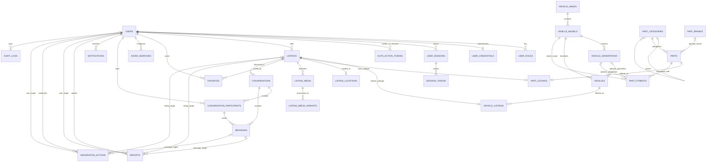

# Marketplace data model

## Overview

PostgreSQL is the canonical store. The modular monolith now owns 29 marketplace/auth/media/parts
tables, with UUID entity identifiers, explicit foreign keys, `timestamptz`,
bounded text/JSON values and PostGIS. Browser authentication is implemented;
Vehicle/Listing seller and public APIs and PostGIS Search are implemented; interactive
map remains future work. See [listings.md](listings.md), [search-and-geo.md](search-and-geo.md)
and [parts.md](parts.md), ADR 0004/0006/0007 for application policies.

Entities live under their owning module's `infrastructure/persistence/`.
`platform/database/entity-registry.ts` is the composition root that registers
them with TypeORM. It must not become a shared business repository. The only
reusable persistence base classes define UUID and timestamp conventions.
Cross-module relation types use public indexes and type-only imports; string ORM
targets resolve through the registry. Nest modules have no circular dependencies,
`forwardRef()`, eager relations or cascade persistence.

Schema changes use reviewed migrations exclusively. `synchronize`, automatic
migration execution and automatic extension installation are disabled. PostgreSQL
17 provides `gen_random_uuid()` without installing a UUID extension at startup.
SQL names use snake_case; TypeScript names use camelCase.

`createdAt` records creation. `updatedAt` is maintained by TypeORM and explicit
SQL updates; it is not a database trigger and raw writers must update it.
Connections use UTC. Append records do not have `updatedAt`. Lifecycle timestamps
are nullable and never initialized by creation defaults.

## Relationships



Report/action target edges are alternatives: exactly one exists per record.
Audit targets intentionally have no FK; they are historical references.

## Identity

| Table / owner                               | Purpose and key fields                                                                             | Private fields / lifecycle                                                                                                                                                                                          |
| ------------------------------------------- | -------------------------------------------------------------------------------------------------- | ------------------------------------------------------------------------------------------------------------------------------------------------------------------------------------------------------------------- |
| `users` / users                             | `id`, `emailNormalized`, `displayName`, `status`, `emailVerifiedAt`, creation/update timestamps    | Email is private and excluded from ordinary selects. Verification is a separate nullable fact. Account lifecycle is `PENDING_VERIFICATION`, `ACTIVE`, `SUSPENDED`, `BLOCKED`. Retain/anonymize referenced accounts. |
| `user_roles` / users                        | Composite PK `(userId, role)`, `createdAt`                                                         | Multiple assignments without duplicates. Stable roles `USER`, `MODERATOR`, `ADMIN` use a CHECK. Role assignment/removal must be authorized and audited by future application operations.                            |
| `user_credentials` / auth                   | PK/FK `userId`, `passwordHash`, creation/update timestamps                                         | Password hash is `select: false`. Separate table preserves auth ownership; user/profile queries never require credential material. Optional row, required hash when row exists.                                     |
| `user_sessions` / auth                      | `id`, `userId`, `expiresAt`, `revokedAt`, `lastUsedAt`, `createdAt`                                | One row per device/session. `id` is the token family identifier; a redundant `familyId` is unnecessary. Revocation is retained until cleanup.                                                                       |
| `session_tokens` / auth                     | `id`, `sessionId`, unique `tokenHash`, expiry, consumption/revocation, creation                    | Excluded hash is a 64-character lowercase hex digest, not a reusable raw token. Consumed hashes remain available for reuse detection.                                                                               |
| `auth_action_tokens` / auth                 | `id`, `userId`, purpose, unique private digest, expiry, consumption/revocation, creation           | Purpose CHECK includes EMAIL_VERIFICATION, PASSWORD_RESET and EMAIL_CHANGE; email-change context binds the new canonical email and retained current session.                                                        |
| `notification_preferences` / email delivery | One row per user with four typed product-email toggles                                             | Missing rows use deterministic defaults; mandatory security email is intentionally not a mutable column.                                                                                                            |
| `notification_deliveries` / email delivery  | Notification/user/channel/template/status, lease/retry timestamps, provider id and safe error code | PostgreSQL is the durable channel queue. Private recipient snapshots are restricted to purpose-specific security mail.                                                                                              |

Email has **one** persisted canonical representation: trim and lowercase via
`normalizeEmail()`, then store `email_normalized`. A unique constraint handles
canonical duplicates, and a CHECK rejects unnormalized writes, including direct
SQL. There is no competing display email column, generated column or `citext`
dependency. The CHECK is a basic sanity boundary; complete email syntax,
internationalized-address policy and verification belong to authentication.
Auth currently accepts ASCII addresses and explicit punycode domains; see
[authentication.md](authentication.md). The separate Authentication migration
adds only the verification fact and action table; it does not alter the existing
marketplace migration or invent verification evidence for legacy ACTIVE accounts.
Action tokens use purpose-separated SHA-256 of 256-bit random secrets, are
single-use and replaceable. Mutations lock users before sessions/tokens. Cleanup
retains complete refresh histories until family absolute expiry plus one day.
Verification/reset action digests have their own expiry and single-use lifecycle.

Country codes similarly enforce uppercase two-letter format, not membership in
an official country list; supported countries need application validation.

Credential hash length checks cannot prove a password was hashed correctly.
Authentication uses Argon2id and random high-entropy refresh/action tokens with
purpose-separated SHA-256 digests. See authentication.md for costs, expiration,
rotation, replay revocation and secure delivery. No passwords/raw tokens are
stored in seeds, logs or audit metadata.

The token history table is necessary: overwriting one hash on `UserSession`
would erase evidence needed to detect reuse. A partial unique index permits only
one unconsumed/unrevoked token per family. Rotation must consume the old token
and insert the replacement atomically; a consumed-token presentation can revoke
the containing session. An expired but unconsumed token still occupies that
slot until explicitly consumed/revoked. Expiration is enforced by auth
checks, not by the partial index. Token expiry must not outlive its session.
Refresh/login/logout application workflows now use these invariants.

## Marketplace subtypes and Parts

The common Listing has no direct vehicle_id. Listings owns vehicle_listings
(listing PK/composite root FK/type constant/vehicle FK) and part_listings
(listing PK/composite root FK/type constant/unique part FK/quantityAvailable).
Constant CHECK + root (id,type) unique key prevents wrong-type and duplicate
subtypes. Exactly-one-link completeness is enforced by atomic application writes.
Parts owns parts/category/brand/fitment; product specifications are not JSON blobs
or fields on Listing. See [Parts](parts.md) and [ADR 0007](adr/0007-multi-category-listings.md).

| Table / owner               | Purpose / constraints                                                                                                            |
| --------------------------- | -------------------------------------------------------------------------------------------------------------------------------- |
| vehicle_listings / listings | Vehicle observation link, preserves old root IDs/history and copy-on-write                                                       |
| part_listings / listings    | One owned product per offer; stock 0-1,000,000 in DB, API active/draft >=1; SOLD atomically zero                                 |
| parts / parts               | Category required, brand nullable, name, NEW/USED/REFURBISHED/FOR_PARTS, canonical optional numbers, fitment mode                |
| part_categories / parts     | Parent adjacency FK/self CHECK, name, unique slug, active/sort order; application serializes ancestor cycle checks               |
| part_brands / parts         | Name, unique slug, active; referenced rows RESTRICT deletion                                                                     |
| part_fitments / parts       | Model required, generation nullable with composite model FK, optional inclusive years 1886-2100; NULLS NOT DISTINCT unique scope |

Part public list requires PUBLISHED, positive stock, valid specification/fitment and
READY primary variants. Parts can omit location; any supplied point uses the existing
privacy contract. Nonunique partial canonical-number indexes allow multiple sellers
to offer the same item; category/brand/fitment indexes support structured access.
No Part-specific media, favorites, messaging, moderation or audit tables exist.

## Vehicle catalog

| Table                 | Purpose / key fields                                                                                                           | Lifecycle and private fields                                                                                                                                |
| --------------------- | ------------------------------------------------------------------------------------------------------------------------------ | ----------------------------------------------------------------------------------------------------------------------------------------------------------- |
| `vehicle_makes`       | Managed reference data: UUID, name, unique slug, timestamps                                                                    | Referenced records use RESTRICT deletion; business administration is future work.                                                                           |
| `vehicle_models`      | Required `makeId`, name, slug unique within make, timestamps                                                                   | Make is derived through the model, not copied onto Vehicle.                                                                                                 |
| `vehicle_generations` | Required `modelId`, unique name within model, `startYear`, optional `endYear`, timestamps                                      | Nullable end year means unknown/open production period. Unique `(id, modelId)` supports the vehicle's composite FK.                                         |
| `vehicles`            | Required `modelId`, optional `generationId`, `year`, `mileageKm`, category fields, optional engine stats/color/VIN, timestamps | Vehicle specification observation, not proof of legal ownership. Preserve when listings reference it. VIN is non-public and excluded from ordinary selects. |

The composite FK `(generation_id, model_id)` → generation `(id, model_id)`
prevents assigning a Mercedes generation to a BMW model. A separate required
model FK also protects vehicles with unknown generation. No `ownerId` or
redundant `makeId` is stored on Vehicle.

Units are kilometres, horsepower (`enginePowerHp`, metric hp as the canonical
catalog convention) and cubic centimetres (`engineDisplacementCc`). Mileage is
nonnegative; optional engine values are positive. Null engine displacement is
appropriate for an electric vehicle. Year CHECK bounds are 1886–2100, avoiding
an annual schema update. The current application uses those bounds; generation
years are descriptive and are not a separate vehicle-year restriction.

Body, fuel, transmission, drive, condition and base color are stable domain
unions backed by `varchar + CHECK`. Values include explicit `OTHER` where needed;
color is optional when unknown. Colors are base categories, not arbitrary paint
names. Make/model/generation are mutable business catalogs backed by tables.
Native PostgreSQL enums were avoided to make changes and reversals explicit
without coupling multiple columns to one difficult-to-remove enum type.

VIN is nullable, normalized uppercase by `normalizeVin()`, exactly 17 characters
with I/O/Q excluded. **It is not globally unique**: resale, separate observations
and historical/imported listings can describe the same physical vehicle. This
field does not establish identity or ownership. Legacy chassis identifiers that
are not standard VINs need a separately reviewed future requirement.

## Marketplace

| Entity / owner        | Key fields and semantics                                                                                                                                                                                       | Private fields / lifecycle                                                                                                                                                                                                                         |
| --------------------- | -------------------------------------------------------------------------------------------------------------------------------------------------------------------------------------------------------------- | -------------------------------------------------------------------------------------------------------------------------------------------------------------------------------------------------------------------------------------------------- |
| Listing / listings    | Required seller UUID, VEHICLE/PART type, user-authored `title` (1–200 trimmed characters), optional description (max 20,000), `priceMinor`, `currency`, status, lifecycle timestamps, version, creation/update | Commercial offer; vehicle specifications are not duplicated. Seller is the listing actor, not a legal vehicle-owner claim. Archive rather than erase historical referenced offers.                                                                 |
| ListingLocation / geo | One-to-zero/one using listing PK/FK; required exact `point`, city, country; optional region and `publicPoint`, creation/update                                                                                 | Exact point is private, `select: false`. Public point is independently supplied, nullable and never automatically copied from exact point. No home/street address is collected.                                                                    |
| ListingMedia / media  | UUID, listing FK, unique `storageKey`, media type, nonnegative sort position, primary flag, processing status, creation/update                                                                                 | Storage key excluded from ordinary selects; generated URLs are presentation artifacts. IMAGE only at this stage. `PENDING → UPLOADED → PROCESSING → READY/FAILED`, logical DELETED and immutable processed variants are implemented; see media.md. |

Price uses **BIGINT minor units** with a nonnegative CHECK. In TypeScript and
future JSON contracts it is a decimal **string**, not a Number; values above
`Number.MAX_SAFE_INTEGER` round-trip exactly. `validatePrice()` rejects
noncanonical/overflowing int64 strings and invalid currency formatting.
`currency` requires three uppercase letters. Format validation does not prove
membership in ISO 4217. The listing application allowlist supports
RUB/EUR/USD/GBP/CHF/CAD/AUD/CNY (exponent 2) and JPY (exponent 0), with a positive
int64 API price requirement. Not all currencies use two fractional digits.
Prices in different currencies must not be compared as equivalent amounts.

Listing states are DRAFT, PENDING_MODERATION, PUBLISHED, REJECTED, SOLD, ARCHIVED.
`submittedAt` is the entry time of the current moderation submission; resubmitting
updates it so the queue is fair. `publishedAt` is the first publication time and
is retained across subsequent moderation/archive. `soldAt` records a sale;
`archivedAt` records archival. They start null. Simple CHECKs require relevant
timestamps for pending/published/sold/archived states and reject sale-before-
publication. Full transition legality, timestamp preservation and edit policy
are application rules, not a SQL state machine. Historical changes belong in
moderation/audit records rather than more lifecycle columns.

`version` defaults to 1 and is mapped by `@VersionColumn`. **That decorator alone
does not prevent lost updates with TypeORM `save()`.** `ListingPersistence` exposes
an atomic compare-and-set price write with `WHERE id/seller_id/version`, increments
version and returns the new version or null. All future mutable listing writes
must follow this pattern. Higher-level status/role authorization still belongs
to application code; the listing application now applies ownership, edit/lifecycle
policies and atomic version/status CAS across vehicle/location/listing/audit writes.

One primary photo **at most** is enforced by a partial unique index on listing
where `is_primary = true`; one photo at every moment is not required for drafts.
Partial unique `(listingId, sortOrder)` for non-DELETED media makes ordering unambiguous. Reordering/swapping
primary images needs a transaction and temporary free positions or clearing the
old primary first. These uniqueness rules are immediate, not deferrable.
Storage-key checks reject obvious paths/URLs but do not replace upload validation,
generated key ownership, file signatures or secure object-storage authorization.
Removing a database media record must coordinate S3 cleanup outside a long DB
transaction. Media now implements that retry-safe workflow; see [media.md](media.md).
PENDING → UPLOADED → PROCESSING → READY/FAILED is authoritative, with logical DELETED
tombstones. Migration adds expiry, source ETag, token/lease, attempts/dispatch and safe
detected metadata. `listing_media_variants` stores composite media/kind keys, private
immutable attempt-specific storage keys, width/height and byte size. It owns no absolute
public URLs. Non-READY primary flags are forbidden. Legacy unvalidated media becomes
FAILED/LEGACY_UNVALIDATED; no migration invents processing evidence.

## User features

`favorites` owns a composite PK `(userId, listingId)` and creation time, preventing
duplicates without an unnecessary externally exposed surrogate ID. Its list
index supports user-scoped keyset pagination. Account/listing deletion can remove
these disposable associations.

`saved_searches` stores UUID, user, bounded name, `filters` JSONB,
`schemaVersion > 0`, `notificationsEnabled` (default false) and timestamps.
Filters are a versioned serialized search request, not canonical vehicle data.
The database requires a JSON object capped at 16 KiB of JSON text. Application
code must validate the complete version-specific filter schema, reject unknown
versions/fields and migrate old representations explicitly. There is no GIN
index: the expected operation lists searches by user, not arbitrary JSON fields.

## Messaging

`conversations` has UUID, required listing FK, immutable buyer ID, creation time,
nullable last-message activity and nullable `sendDisabledAt`. The latter is an
efficient projection of immutable moderator removal: history remains readable while
new messages are rejected. `(listingId, buyerId)` is unique, so
concurrent open requests cannot create duplicate marketplace dialogs. Seller
identity remains authoritative on the linked Listing.
`conversation_participants` has composite PK `(conversationId, userId)`, joined
and optional exact read watermark `(lastReadAt,lastReadMessageId)`, permitting
groups without duplicate members. The composite read-message FK proves that a
watermark message belongs to the same conversation. The user/conversation index
supports inbox and global-unread ownership scans. `lastMessageAt` avoids a
per-row max query for inbox ordering; message content is never copied there.

`messages` has UUID, conversation, sender, private body (1–8000 trimmed
characters), client-generated idempotency UUID, creation and optional
edit/redaction timestamps. It is owned by
messaging. Body is excluded from ordinary selects. The cursor is
`(createdAt, id)` within one conversation; timestamps need not be unique. The
composite sender FK references `(conversationId, userId)` in participants, so
**the DB itself guarantees sender membership without a trigger**. Participant
rows must be retained while their messages exist. Application code still checks
who may read/send/edit/redact and whether membership is currently permitted;
membership is not equivalent to authorization.

`(conversationId,senderId,clientMessageId)` is unique. Same-body retries return
the original record; a changed-body retry is a conflict. `MESSAGE_CREATED` is
written to the transactional outbox with the Message, and the notification
fanout excludes message body.

`deletedAt` is a deliberate redaction marker, not a TypeORM global soft-delete
filter. Redaction must replace body with a neutral nonempty tombstone in the same
transaction; a timestamp alone does not erase private text. This permits message
reports and stable history to remain linked. Redaction/retention workflows are
not implemented.

## Notifications

`notifications` has UUID, user, type, JSONB payload, optional `readAt` and creation
time. Types: NEW_MESSAGE, LISTING_STATUS_CHANGED, MODERATION_RESULT, PRICE_CHANGED,
SAVED_SEARCH_MATCH. Payload is a private, bounded JSON object varying by event;
it should contain identifiers and minimal safe event data, not message bodies,
credentials or precise coordinates. Complete discriminated payload validation
belongs to future application code. No delivery/preference/queue subsystem is
implemented. User/time and partial unread indexes support bounded lists without
a global scan; readAt cannot precede creation.

## Moderation

`reports` has UUID, required reporter, target discriminator, one concrete target
FK, machine `reasonCode`, optional private details (1–2000), status
OPEN/IN_REVIEW/RESOLVED/DISMISSED, resolution/resolver/private note, resolution
time and creation/update timestamps. Terminal statuses require all resolution
fields. Partial unique indexes enforce one active report per reporter/target but
permit a later report after final resolution. It owns the queue and historical
complaint, not the target.

Report targets use `listingId`, `targetUserId`, `messageId` plus **one explicit
exclusive-target CHECK** tied to `targetType`. Exactly one FK is populated and
must refer to an existing row. This deliberately uses three nullable columns for
a closed set of three target types: it preserves ordinary referential integrity
and one unified queue. An unchecked polymorphic `(type, id)` could create orphan
targets; three independent report tables would duplicate lifecycle/queue code.
Adding a new target type requires a reviewed column/FK/CHECK migration.

`moderation_actions` uses the same concrete-target structure, required moderator,
action, machine reason code, optional seller-visible message, private internal
note/JSON metadata and creation time. CHECKs match actions to
the target kind (e.g. BLOCK_USER cannot target a listing). It is append-oriented
history with no ordinary edit boundary. All target/moderator FKs RESTRICT
deletion. The DB cannot ensure a moderator currently has permission; that must
be checked centrally and the operation/action record written atomically.
Metadata is a bounded object with purpose-specific validated safe content;
raw request bodies, personal text and credentials are prohibited.

## Audit

`audit_logs` stores UUID, optional actor (null for system/removed actor), machine
action, target type/UUID, private metadata, optional bounded request ID and creation.
It has no update timestamp or public edit interface. `AuditWriter.append()` is
the module's explicit persistence boundary and accepts a caller's EntityManager
so business changes and audit insertion can be transactional. Metadata allows
only changed-field names and machine status/reason codes; unexpected keys and
free text are rejected. Never persist passwords, token hashes/raw tokens,
cookies, headers, email/phone, precise coordinates or complete sensitive payloads.

Audit target references deliberately have no FK: events must survive target
deletion and can describe future entity types. The actor FK uses SET NULL rather
than CASCADE, preserving the historical event. Target existence/operation validity
are the originating application's responsibility. `actorUserId` can become null
after controlled account purging, so immutable history does not imply immutable
actor linkage. Append orientation is an application boundary, **not tamper-proof
storage**: production must use a runtime DB role without ordinary UPDATE/DELETE
on history tables and a separately authorized retention/migration role. No role
provisioning or audit mutation trigger is introduced here.

## Index strategy

B-tree indexes are ascending and can be scanned backward for newest/descending
queries. Every growing list needs a bounded limit and a stable ID tie-breaker.
These indexes support the following concrete access patterns, not every possible
filter permutation. PK/unique constraints also create useful indexes.

| Index / key                                                                                                            | Expected query and reason                                                                                                                                    |
| ---------------------------------------------------------------------------------------------------------------------- | ------------------------------------------------------------------------------------------------------------------------------------------------------------ |
| `ix_listings_published_newest` `(publishedAt,id)` WHERE PUBLISHED                                                      | Public newest listing cursor; excludes historical inactive rows.                                                                                             |
| `ix_listings_published_price` `(currency,priceMinor,id)` WHERE PUBLISHED                                               | Price range/ascending/descending within one currency.                                                                                                        |
| `ix_listings_seller_created` `(sellerId,createdAt,id)`                                                                 | Seller's offers in all states and seller FK checks.                                                                                                          |
| `ix_listings_seller_updated` `(sellerId,updatedAt,id)`                                                                 | Seller updated_newest dashboard; added by migration after query-plan review.                                                                                 |
| `ix_vehicle_listings_vehicle` `(vehicleId)`                                                                            | Subtype vehicle join/filter and referenced-observation deletion checks.                                                                                      |
| `ix_listings_moderation_queue` `(submittedAt,id)` WHERE PENDING_MODERATION                                             | Current submissions in arrival order, including resubmissions.                                                                                               |
| `ix_vehicles_model_year` `(modelId,year,id)`                                                                           | Make→models→vehicles, model/year ranges; model FK checks.                                                                                                    |
| `ix_vehicles_generation_model` `(generationId,modelId)`                                                                | Generation filters and composite FK checks.                                                                                                                  |
| `ix_vehicles_body_fuel` `(bodyType,fuelType,id)`                                                                       | Common categorical candidate filtering; other filters applied to candidates.                                                                                 |
| `ix_listing_locations_point` GiST `(point)`                                                                            | SRID4326 envelope intersection `point && ST_MakeEnvelope(...)`; geometry distances are angular degrees.                                                      |
| `ix_listing_locations_geography` GiST `(point::geography)`                                                             | `ST_DWithin(..., metres)` radius search and geography `<->` nearest ranking. Expression index is explicitly SQL-managed (`synchronize:false` on this index). |
| `ix_favorites_user_created` `(userId,createdAt,listingId)`                                                             | User's newest saved offers; PK already guarantees pair uniqueness.                                                                                           |
| `ix_favorites_listing` `(listingId)`                                                                                   | Inverse FK lookup and safe listing cleanup.                                                                                                                  |
| `ix_saved_searches_user_created` `(userId,createdAt,id)`                                                               | User-owned saved searches and user cleanup.                                                                                                                  |
| `ix_saved_searches_enabled_type` partial `(listingType,id)`                                                            | Bounded enabled SavedSearch candidate traversal for publication events.                                                                                      |
| `uq_saved_searches_user_fingerprint`                                                                                   | One canonical Search-v2 filter set per user and Listing type.                                                                                                |
| `ix_conversations_listing_created` `(listingId,createdAt,id)`                                                          | Conversations about an offer and listing FK checks.                                                                                                          |
| `uq_conversations_listing_buyer` `(listingId,buyerId)`                                                                 | One buyer dialog per Listing, including concurrent open requests.                                                                                            |
| `ix_conversations_activity` `(lastMessageAt,id)`                                                                       | Bounded recent-activity ordering support; participant ownership is resolved first.                                                                           |
| `ix_conversation_participants_user` `(userId,joinedAt,conversationId)`                                                 | User-scoped conversations; composite PK covers the opposite direction.                                                                                       |
| `ix_conversation_participants_user_conversation` `(userId,conversationId)`                                             | Inbox/global unread membership lookup without depending on join time.                                                                                        |
| `ix_messages_conversation_cursor` `(conversationId,createdAt,id)`                                                      | Latest/history pages by conversation with `(createdAt,id)` keyset ordering; also conversation/participant FK-prefix checks.                                  |
| `ix_messages_sender` `(senderId)`                                                                                      | Controlled account-message redaction/retention lookup.                                                                                                       |
| `uq_messages_sender_client` `(conversationId,senderId,clientMessageId)`                                                | Idempotent and concurrency-safe message retries.                                                                                                             |
| `ix_notifications_user_created` `(userId,createdAt,id)`                                                                | Latest notifications and user FK checks.                                                                                                                     |
| `ix_notifications_user_unread` same keys WHERE readAt IS NULL                                                          | Small unread subset without scanning old read notifications.                                                                                                 |
| `uq_notifications_event_recipient_type` partial                                                                        | Idempotent at-least-once event fanout per recipient and notification type.                                                                                   |
| `ix_outbox_events_claim`, `ix_outbox_events_processing_lease`                                                          | Pending/retry claim order and stale processing lease recovery.                                                                                               |
| `ix_reports_queue`, `ix_reports_status_queue`                                                                          | Active/default and status-filtered complaint queues; partial unique indexes bound active duplicate reports.                                                  |
| `ix_moderation_actions_*` actor/target + time/ID                                                                       | Moderator history and each concrete target's decisions; target indexes exclude nulls.                                                                        |
| `ix_audit_logs_actor_created`, `ix_audit_logs_target_created`, `ix_audit_logs_created`, `ix_audit_logs_action_created` | Actor, target, global and exact-action bounded timelines.                                                                                                    |
| `ix_users_admin_status_created`, `ix_user_roles_role_user`                                                             | Status/created user administration pages and role-filter membership lookup.                                                                                  |
| `ix_user_sessions_user_created`, `ix_user_sessions_expiry`                                                             | Device list/revoke-all and bounded expiry cleanup.                                                                                                           |
| `ix_session_tokens_session`                                                                                            | Token family history and retention cleanup; unique hash index locates a presented token's digest.                                                            |
| `uq_session_tokens_live`, `uq_listing_media_primary`                                                                   | Partial uniqueness enforces one active rotation slot and at most one primary image.                                                                          |
| `uq_notification_preferences_user`                                                                                     | One typed preference row per user.                                                                                                                           |
| `ix_notification_deliveries_claim`, `ix_notification_deliveries_lease`                                                 | Bounded pending/retry claims and stale PROCESSING recovery.                                                                                                  |
| `uq_notification_deliveries_notification_channel`, `uq_notification_deliveries_dedupe`                                 | One EMAIL intent per Notification plus stable replay-safe security delivery keys.                                                                            |

Core mileage/transmission/drive/condition fields remain typed relational columns.
Year/mileage sorting across arbitrary broad filters can require bounded candidate
sorting; dedicated indexes/denormalization must follow measured EXPLAIN ANALYZE
on realistic data. No N+1-loading policy is implied by entity relations: future
queries must select/join explicitly and cap result sets. The test verifies actual
index definitions and spatial results; a three-city fixture is **not evidence of
production query speed or planner index selection**. Two spatial indexes incur
storage/write cost but serve different units and operators without duplicating
the exact coordinate column. Do not replace metre queries with degree distances.
Public marker bbox uses the additional partial GiST `ix_listing_locations_public_point`
on `(public_point) WHERE public_point IS NOT NULL`, added by the Search migration after
EXPLAIN review. Private list/radius indexes remain separate; map never falls back to
the exact point. No partitioning, search-document table, OpenSearch or speculative GIN indexes.

## Database invariants vs application rules

| Guaranteed by database                                                                                              | Must be guaranteed by application                                                                                           |
| ------------------------------------------------------------------------------------------------------------------- | --------------------------------------------------------------------------------------------------------------------------- |
| Required IDs, uniqueness, referential targets, matching generation/model, sender membership                         | Actor authorization, role assignment, current membership validity, seller status and resource ownership                     |
| Allowed statuses/categories, nonnegative money/mileage/position, positive engine stats, basic year/VIN/code formats | Full lifecycle transitions, supported currencies/exponents, email verification, year plausibility and VIN visibility policy |
| Point shape/SRID/ranges, nonempty geometry                                                                          | Public precision policy and protection from location triangulation                                                          |
| Exclusive report/action targets, action-kind compatibility, timestamp sanity                                        | Moderation permissions, queue claims/concurrent decisions, safe reasons/metadata and transactional effects                  |
| Bounded object JSONB and positive saved-search version                                                              | Exact payload schemas, allowed filter versions/keys, secret-free event data                                                 |
| At most one live token hash per family                                                                              | Token generation, digesting, expiry/reuse checks, rotation, session revocation and cleanup policy                           |
| Listing version number and atomic CAS through the explicit primitive                                                | Every mutable writer uses CAS; never rely on plain entity save for concurrency                                              |

## Privacy

Ordinary TypeORM selections exclude email, password hash, refresh digests, VIN,
exact point, storage keys, message text, notification payload, report reason and
internal moderation/audit metadata. Explicit privileged reads remain possible.
`select:false` reduces accidental exposure; it does not authorize access or
prevent an explicitly selected property from being serialized. **Never return
ORM entities directly as API responses.** Build allowlisted response DTOs and
enforce authorization on the server.

Public geo must use an explicit coarse representation. Missing `publicPoint`
does not authorize falling back to exact `point`. Public distance/radius behavior
also needs a privacy decision because repeated exact queries can reveal a seller's
location. The schema stores no street/home address, phone/IP/device fingerprint.
No specific public precision algorithm or retention deadline is claimed here.

## Data retention and deletion strategy

| Entity                             | Logical operation and FK consequences                                                                                                                                                                                                                                                                                                                                                                                                                                  |
| ---------------------------------- | ---------------------------------------------------------------------------------------------------------------------------------------------------------------------------------------------------------------------------------------------------------------------------------------------------------------------------------------------------------------------------------------------------------------------------------------------------------------------- |
| User                               | Block/revoke then anonymize a retained tombstone when business/history references exist. Replace canonical email with a unique nonpersonal tombstone and display name with a neutral value; delete credential/session/preference rows explicitly. No universal `deletedAt`. RESTRICT on offers/participants/reports/actions prevents accidental historical loss. Controlled hard purge is possible only after retention obligations are met; audit actor becomes null. |
| Listing                            | ARCHIVED + archivedAt; retain seller, vehicle and linked conversations/moderation. Hard deletion is restricted by media/conversations/reports/actions. Favorites and location cascade only if a controlled listing purge is possible.                                                                                                                                                                                                                                  |
| Vehicle/catalog                    | Preserve referenced specifications/catalog rows. RESTRICT prevents deleting data needed to interpret an offer; VIN can be cleared by an authorized privacy operation without erasing the vehicle row.                                                                                                                                                                                                                                                                  |
| Photo                              | Deliberate media-row deletion/reordering and retry-safe S3 object cleanup. Listing deletion does not silently cascade media and orphan the objects. No automatic purge is implemented.                                                                                                                                                                                                                                                                                 |
| Message/participant/conversation   | Keep IDs and relations; redact body with a neutral tombstone and deletedAt, clear any unnecessary private text. RESTRICT retains complaint targets and sender membership history. A deletedAt flag alone is insufficient. Hard retention purges must remove dependent records in a reviewed order.                                                                                                                                                                     |
| Favorite/saved search/notification | Disposable user-owned data; CASCADE on a controlled account hard purge. They can be removed explicitly during anonymization.                                                                                                                                                                                                                                                                                                                                           |
| Session/token/credential           | CASCADE for controlled user/session hard deletion. Revoke before cleanup, retain consumed hashes through the family's expiry/reuse-detection window, then purge by a bounded job.                                                                                                                                                                                                                                                                                      |
| Report/ModerationAction            | Retain linked case/decision history; no deletion cascades from reporter, moderator or target. Reasons/metadata must be minimal and subject to an explicit future retention/redaction policy.                                                                                                                                                                                                                                                                           |
| AuditLog                           | Append-oriented retained history; SET NULL for removed actor, no target FK/cascade. Retention export/purge must use separate authorization and preserve required investigation evidence.                                                                                                                                                                                                                                                                               |

Anonymization, legal retention deadlines, message-edit history and GDPR workflows
are future business decisions. This schema makes deletion explicit; it does not
implement compliance workflows or promise that history can be kept forever.

## Migrations, seeds and verification

Order:

1. `1789590000000-EnablePostgis.ts` (existing): idempotent extension installation;
   rollback intentionally preserves an extension that may predate the application.
2. `1789600000000-MarketplaceSchema.ts`: 21 tables, local constraints, indexes,
   foreign keys and geography expression GiST; no reference/user seed data.

3. `1789610000000-Authentication.ts`: verification timestamp and purpose-specific action tokens.
4. `1789700000000-ListingSellerUpdatedIndex.ts`: deterministic seller updated traversal.
5. `1789800000000-MediaWorkflow.ts`: upload/worker/variants/cleanup persistence.
6. `1789900000000-PublicLocationSearchIndex.ts`: partial publicPoint GiST.
7. `1790000000000-MarketplaceListingSubtypes.ts`: root discriminator and six subtype/Parts tables,
   backfilled vehicle links before removing root vehicle_id. Safe vehicle-only rollback
   restores the link; any Part products/PART offers block rollback. Populated legacy
   root/media/location/favorite/conversation/report/moderation/audit snapshots are tested.
8. `1790100000000-ModerationWorkflow.ts`: moderation/admin queue and audit indexes,
   report resolution fields, user status reason, and listing moderation timestamps.
9. `1790200000000-EngagementOutbox.ts`: durable outbox, typed Favorites and Saved
   Searches, canonical fingerprint uniqueness, versioned Notification payloads,
   and event/recipient/type notification deduplication.
10. `1790300000000-MessagingRealtime.ts`: conversations, private messages,
    participant read watermarks and message outbox events.
11. `1790400000000-AccountEmailDelivery.ts`: email-change token context, typed
    notification preferences and durable external delivery state/indexes.
12. `1790500000000-MessagingModerationReadOnly.ts`: moderator-removal read-only
    projection on existing conversations; rollback removes only that projection.

The original schema migration's down drops child tables before parents, without CASCADE,
and retains PostGIS and the migration journal. **Rollback destroys marketplace
table data** and is for controlled migration recovery/empty test databases;
production recovery requires an explicit backup/forward-repair plan.
Future schema changes must be separate migrations, not edits to an applied file.

```sh
npm run migration:run
npm run seed:catalog       # optional development-only reference data
```

The seed also adds a small idempotent Part category/brand development fixture; no business products or offers.
The vehicle seed adds BMW, Mercedes-Benz, Audi, Volkswagen, Toyota, six models and six
generations, using deterministic UUIDs for newly inserted rows. It is a separate
transactional development/test operation, refuses production, preserves existing
catalog rows and their IDs, and can be repeated without duplicates. It does not
create accounts or credentials. Production catalog ingestion needs reviewed data
and its own authorized workflow.

PowerShell isolated verification:

```powershell
npm run infra:test:up
$env:NODE_ENV = 'test'
npm run migration:run
npm run migration:run       # no pending migrations
npm run seed:catalog        # optional: still targets .env.test
npm run test:integration
Remove-Item Env:NODE_ENV
npm run lint
npm run typecheck
npm test
npm run build
```

The schema suite creates a uniquely named database ending `_test` from template0
on the test server and drops **only that owned database** in finally. The test
DB role therefore needs CREATEDB and extension-installation privileges (provided
by isolated local Compose). Configured dev/test databases are never recreated or
truncated. The suite checks clean application of every registered migration, repeated
apply, search/media/index/auth/schema rollback, reapply, zero TypeORM schema diff, actual constraints/indexes,
all-table persistence, exact money, FK/uniqueness failures, real spatial queries,
membership, rotation history, sensitive selection, retention and concurrent CAS.
Integration files run sequentially; infrastructure smoke independently verifies
HTTP readiness, Redis, S3 and shutdown. No real production service or credentials
are used.

## Future extensions and next step

Potential millions of historical offers/messages/audit events are addressed by
bounded keyset indexes and explicit history retention. Partitioning/search indexes
and broader filter indexes require measured workloads, not more empty tables.
Vehicle edits preserve other listings through immutable observation copy-on-write
and principal-scoped Listing CAS. ADR 0004 documents retained observations and
the deliberate absence of a full revision/cleanup interface.

Dealer/organization support can introduce organizations, memberships and an
explicit seller actor associated with listings; `sellerId` currently records the
human seller. It does not impose permanent personal vehicle ownership. Introducing
dealer authority and migration/backward compatibility must be a separate ADR;
no dealer/permissions tables are created preemptively.

Authentication, sessions and authorization now use these persistence boundaries;
see [authentication.md](authentication.md) and ADR 0003. Media uploads, processing and
photo management are implemented; see [media.md](media.md) and ADR 0005.
Geo/Search is implemented with one projection SELECT and a new partial GiST on public_point;
see search-and-geo.md and ADR 0006. Next is interactive map; messaging and notifications remain later tasks.
