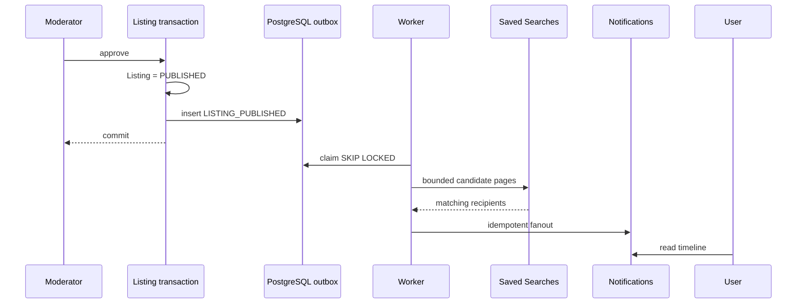

# Favorites, Saved Searches, and Notifications

## Overview

The engagement subsystem adds user-owned Favorites, versioned Saved Searches, an
in-app Notification Center, and a durable PostgreSQL transactional outbox. It is
part of the modular monolith. Domain events, notifications, and future delivery
attempts are separate concepts: an event describes a committed business fact; a
notification is a user-visible record; email, push, or realtime transport would
deliver that record later.

## Favorites

Authenticated users use `PUT /api/v1/me/favorites/:listingId`, idempotent
`DELETE`, and cursor-paginated `GET /api/v1/me/favorites`. The list accepts
`type=VEHICLE|PART`, `limit` (default 20, maximum 50), and an opaque signed
cursor bound to the type filter. Only a currently `PUBLISHED` listing satisfying
the public media and subtype invariants can be added. New favorites cannot be
created for `SOLD` listings.

The list uses a bounded batch projection for Listing, subtype, location, and the
READY primary thumbnail. It does not issue one query per card. `PUBLISHED` and
historical `SOLD` cards remain readable. A rejected, archived, removed, deleted,
or malformed legacy listing becomes an `UNAVAILABLE` tombstone containing only
its listing ID and the time it was favorited. This prevents old private content,
storage keys, seller details, VINs, and exact locations from leaking.

## Saved Searches

`POST/GET /api/v1/me/saved-searches` and owner-scoped `PATCH/DELETE
/api/v1/me/saved-searches/:id` manage at most `SAVED_SEARCH_MAX_PER_USER`
records. Creation takes a display name, `VEHICLE|PART`, a structured filter
object, and `notificationsEnabled`. The Search v2 parser remains authoritative:
cross-type keys, unknown values, invalid ranges, unsupported currencies, and
oversized multi-values are rejected rather than stored as arbitrary JSON.

Filters are serialized with sorted keys and normalized multi-select values. A
SHA-256 fingerprint over schema version, listing type, and canonical filters
enforces one equivalent search per user/type. An advisory transaction lock on
the user makes the maximum count safe under concurrent creates. Unknown schema
versions are returned as unsupported and cannot be enabled silently.

Transient fields (`cursor`, `limit`, and sort) are not persisted. A search must
have at least one meaningful filter before notifications can be enabled.

## Location privacy

Browser `lat/lng/radiusMeters` Near Me origins are rejected with
`SAVED_SEARCH_LOCATION_NOT_SAVABLE`. They remain in browser memory only. An
explicit `bbox` chosen as an area can be saved; it uses the same inclusive and
antimeridian-aware semantics as Search. Matching reads exact ListingLocation
coordinates internally because public search area membership uses the private
point. Neither those coordinates nor derived exact distances are put in the
SavedSearch, event, notification, log, or public response.

## Matching

A `LISTING_PUBLISHED` worker pass loads one publication-safe Search projection
for the listing. It then pages enabled SavedSearch candidates by listing type
and schema version. The candidate query is bounded and checkpointed; it does not
query the listing separately for every saved search. The in-memory predicate
implements the same canonical filters as Search:

- Cars: catalog IDs, year/mileage, categorical attributes, currency/price, and bbox;
- Parts: category subtree, brand, condition, exact part numbers, universal and
  vehicle-specific compatibility, generation/year rules, currency/price, and bbox.

Part fitments and the active category ancestor chain are loaded once for the
published Part. A search created after the event's `occurredAt` is not matched
retroactively. Disabled, deleted, corrupt, and unsupported searches are inert.
The seller is excluded. Multiple matching searches belonging to one user create
one notification for that listing event.

## Notifications

Supported validated payloads are:

- `MODERATION_RESULT`;
- `ACCOUNT_STATUS_CHANGED`;
- `SAVED_SEARCH_MATCH`;
- `FAVORITE_LISTING_STATUS_CHANGED` (`SOLD` or generic `UNAVAILABLE`).

Legacy/future stored types remain safely renderable as a generic notification;
the writer refuses unsupported payloads. Every new payload contains
`schemaVersion: 1`. Public mapping allowlists fields per type and creates only
server-derived listing targets. It never accepts a URL, so notifications cannot
create an open redirect. Moderator removal notifications deliberately contain no
moderation reason, report details, or moderator identity.

The private API is:

- `GET /api/v1/me/notifications?limit=20&unreadOnly=false&cursor=...`;
- `GET /api/v1/me/notifications/unread-count`;
- `POST /api/v1/me/notifications/:id/read`;
- `POST /api/v1/me/notifications/read-all`.

Timeline pagination uses signed, filter-bound keyset cursors. Reads are
idempotent and owner-scoped. Read-all captures a database timestamp and updates
only rows created at or before that cutoff, so a concurrent later notification
stays unread. Blocked users cannot use this history because normal authentication
status checks still apply; it is not a guaranteed security delivery channel.

## Transactional Outbox

Listing publication, seller sold/archive, and moderator removal insert a minimal
versioned event into `outbox_events` in the same PostgreSQL transaction as the
Listing state change, audit/moderation records, and any direct same-database
seller notification. A rollback removes the event with the business change.

If commit succeeds and the process crashes, the event remains `PENDING`. If a
worker crashes after claim, a later worker reclaims the stale `PROCESSING` lease.

## Worker

Run `npm run worker:engagement` as a separate process. It polls PostgreSQL
directly; Redis/BullMQ is intentionally absent from this flow. Claims use
`FOR UPDATE SKIP LOCKED`, `OUTBOX_BATCH_SIZE`, and a lease. Processing is
at-least-once. Transient failures use exponential backoff and no more than
`OUTBOX_MAX_ATTEMPTS`; malformed payloads become terminal `FAILED` records.
Structured logs contain event/listing IDs, type, attempt, duration, and result
count, but no coordinates or stored filters.

Fanout commits notification inserts and the event checkpoint together for each
bounded recipient/candidate page. A crash before commit repeats the page; a crash
after commit resumes after its checkpoint. The partial unique index on
`(user_id, source_event_id, type)` makes replay harmless. Inactive recipients are
filtered in each transaction.

Recover all failed events with `npm run outbox:recover`; pass an event UUID after
`--` to recover one. Processed events are retained for operations/debugging;
production must set a reviewed retention job before volume requires cleanup.
The worker's ready log and process liveness are the current health contract.

Direct moderation/account notifications remain synchronous because they are a
single recipient and use the same database transaction. External delivery must
never run inside that business transaction.

## Performance

The migration adds:

- `ix_favorites_user_type_created` for typed keyset pages;
- `ix_saved_searches_enabled_type` for notification candidates;
- `ix_outbox_events_claim` for pending/retry claims;
- `ix_outbox_events_processing_lease` for stale lease recovery;
- `uq_notifications_event_recipient_type` for fanout idempotency.

Existing `ix_favorites_user_created`, `ix_notifications_user_created`, and the
partial `ix_notifications_user_unread` serve the unfiltered favorites timeline,
notification timeline, and unread count. `npm run engagement:plans` creates an
owned database with 10,000 users and 30,000 rows in each main workload, runs
`EXPLAIN (ANALYZE, BUFFERS)`, verifies the named indexes, and measures candidate
selection, matching, and insertion. Its output is a development benchmark, not
a production SLA.

The 2026-09-25 local review used 10,000 users and 30,000 each of Listings,
Favorites, SavedSearches, Notifications, and Outbox events. PostgreSQL selected
`ix_favorites_user_created` (20 rows, 0.029 ms),
`ix_saved_searches_enabled_type` (200 rows, 0.300 ms),
`ix_notifications_user_unread` (0.025 ms),
`ix_notifications_user_created` (20 rows, 0.058 ms), and
`ix_outbox_events_claim` (50 rows, 0.055 ms). Candidate selection for 15,000
Vehicle and 5,000 Part subscriptions took 47.295 ms; canonical matching took
171.440 ms and two idempotent notification fanout inserts took 228.729 ms. These
are one-machine development measurements and are not production guarantees.

## Security

All endpoints require an active authenticated principal and scope every mutation
by that user. IDs pass UUID validation. External fields are validated before
persistence, query values are bound, sort/order SQL is fixed, lists are bounded,
and writes have engagement-specific rate policies. Cursor contents are encrypted
and authenticated by the existing `OpaqueCursor`. Exact points, credentials,
email, private seller data, moderation internals, storage keys, and arbitrary
links are absent from event and notification payloads.

## Future delivery

Email, push, WebSocket/SSE, per-channel preferences, and digests are deferred.
A future delivery subsystem can consume persisted Notification IDs and keep its
own retry/idempotency state without changing domain-event durability.

## Known limitations

SavedSearch filter updates require delete/recreate; PATCH currently changes name
and notification state. There is no price-change producer because published
Listing edits are not a supported product workflow. Notification updates are
request/refresh based rather than realtime. Outbox retention is documented but
not automated. Playwright is not installed, so browser behavior has a manual QA
checklist rather than automated browser E2E coverage.
