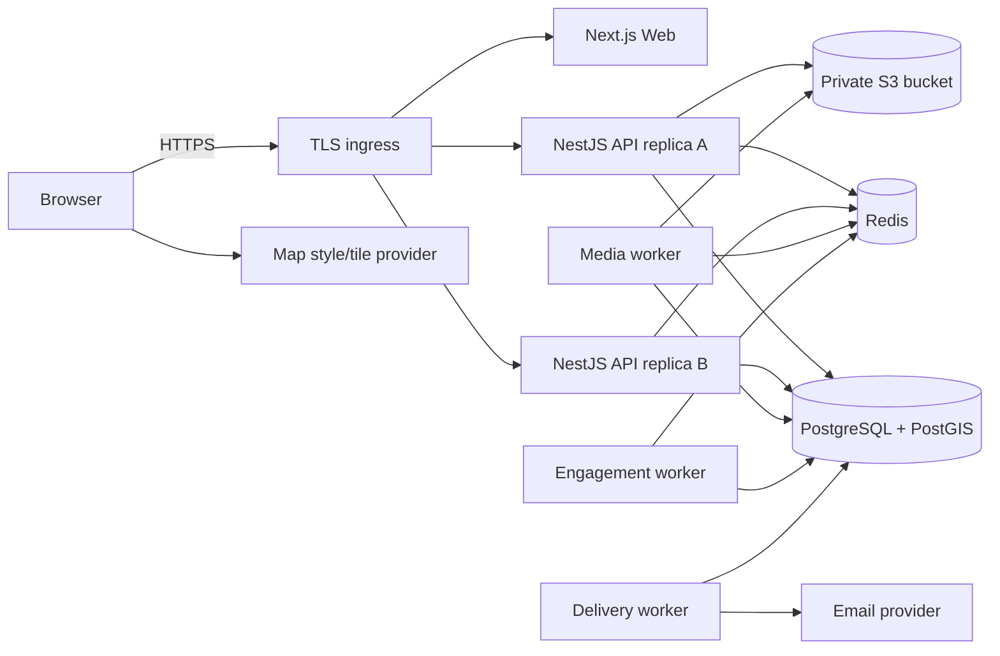
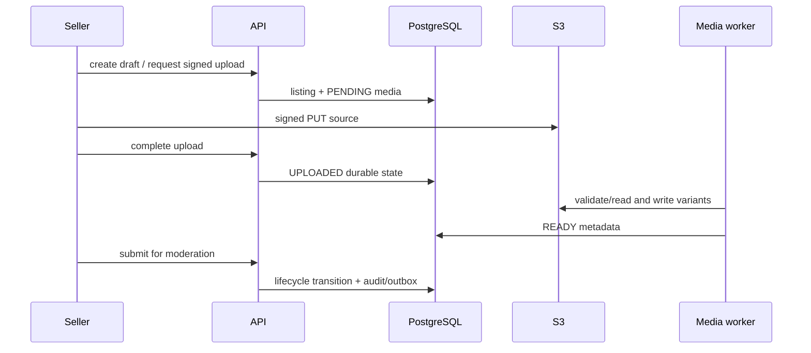
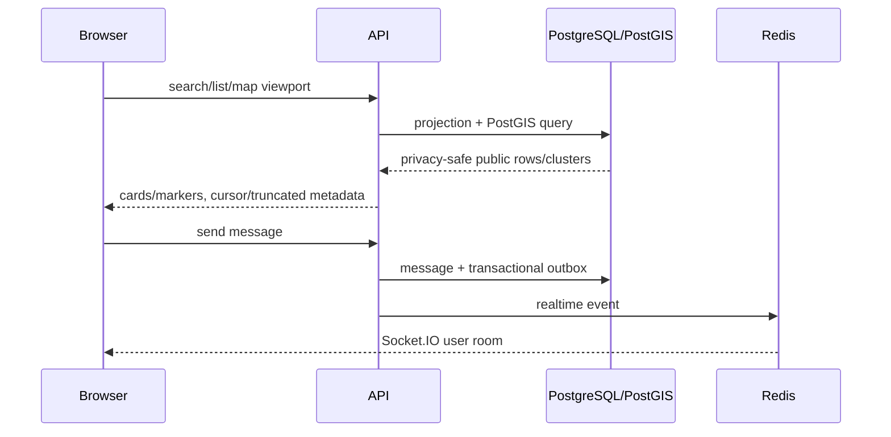

# Client handoff index

This repository is the handoff package for Automotive Marketplace `0.1.0-rc.1`.
It is intended for backend/frontend engineers, DevOps/SRE, security engineers and
technical product owners. It contains no production credentials or assumed
vendor account.

## System overview

Web, API and workers are stateless with respect to authoritative business state.
PostgreSQL is authoritative; Redis is coordination/cache/fanout; S3 stores media.
See [Architecture](../architecture.md), [Data model](../data-model.md) and the
[ADR index](../adr/README.md).

## Principal data flows

Notification/email events are committed to the transactional outbox with the
business change, expanded by the engagement worker, and sent from durable
delivery rows by the delivery worker. HTTP inbox/history is authoritative when a
realtime event is missed.

## Repository and development

- `apps/web`: Next.js App Router frontend.
- `apps/api`: NestJS modular-monolith API, workers, migrations and operations.
- `docs`: architecture, domain, QA, operations, release and handoff knowledge.
- `infra`: reference proxy and monitoring examples.
- `e2e`, `security`, `load`: isolated verification assets.

Follow the root [README](../../README.md) and [CONTRIBUTING](../../CONTRIBUTING.md)
for clean-clone onboarding. No global package or developer-specific path is
required.

## Engineering knowledge map

| Area                                   | Primary document                                                               |
| -------------------------------------- | ------------------------------------------------------------------------------ |
| Auth/sessions/RBAC                     | [Authentication](../authentication.md)                                         |
| Listings and lifecycle                 | [Listings](../listings.md)                                                     |
| Cars/Parts persistence                 | [Data model](../data-model.md), [Parts](../parts.md)                           |
| Search/Geo/Map                         | [Search/Geo](../search-and-geo.md), [Map](../map.md)                           |
| Media                                  | [Media](../media.md)                                                           |
| Moderation/Admin                       | [Moderation/Admin](../moderation-and-admin.md)                                 |
| Favorites/Saved Searches/Notifications | [Engagement](../favorites-saved-searches-notifications.md)                     |
| Messaging/realtime                     | [Messaging](../messaging-and-realtime.md)                                      |
| Account/email                          | [Account/email delivery](../account-and-email-delivery.md)                     |
| Reliability/recovery                   | [Reliability](../reliability.md), [Disaster recovery](../disaster-recovery.md) |

## Operations and release

- [Production deployment contract](../deployment/README.md)
- [Environment and secrets](../deployment/environment.md)
- [Operations runbook](../operations/runbook.md)
- [Operational commands](../operations/commands.md)
- [Monitoring and alert routing](../operations/monitoring.md)
- [Production readiness](../operations/production-readiness-checklist.md)
- [Release deployment verification](../qa/release-deployment-report.md)
- [Release checklist](../release/release-checklist.md)
- [Release notes](../release/0.1.0-rc.1.md)
- [Security reporting](../../SECURITY.md)

## Handoff governance

- [Transfer checklist](checklist.md)
- [Component ownership and RACI](ownership.md)
- [Known limitations and post-launch backlog](known-limitations.md)

The client must own DNS/TLS, registry, managed PostgreSQL/Redis, S3, email/map
providers, secret manager, monitoring/on-call and backups. Credentials transfer
occurs through the client's secret manager, never this repository.

The database currently has twelve ordered migrations. Read the migration table
at deploy time rather than duplicating schema state here. No open-source license
has been selected; license/IP terms are **PENDING CLIENT LEGAL**.
