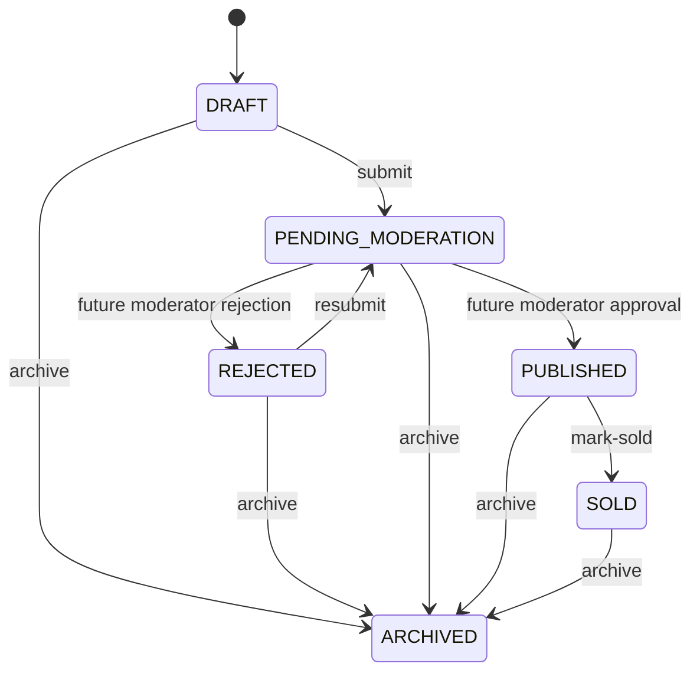

# Vehicle and listing workflows

## Multi-category extension

Listing is now the shared VEHICLE/PART root. vehicle_id moved to vehicle_listings;
vehicle command/detail payloads remain vehicle-only. Seller list defaults to both
types with optional type filter; detail/transitions/media return a discriminated
union. Parts has separate create/detail/edit routes, using the same
CAS and lifecycle. Vehicle invariant/location/copy-on-write behavior is preserved.
See [parts.md](parts.md) and ADR 0007 for migration, stock, fitment and API contracts.
Public discovery is the unified Search schema v2 for VEHICLE and PART.

## Overview and ownership

Listings owns offers, their seller and lifecycle. Vehicles owns specifications and
the Make/Model/Generation catalog; Geo owns listing locations; Users supplies a
batch public display-name projection; Audit owns append-only machine events.
Listings calls their explicit transaction-aware APIs through module indexes. It
does not query their private tables. Controllers handle transport, principal,
validation and response headers; application services own business operations.

All seller routes require the existing Bearer AuthenticationGuard. It checks the
current PostgreSQL session, account status, email verification and roles. Any
authenticated account can sell; there is no separate SELLER role. Every private
read and mutation selects by **both listing ID and principal user ID**. A foreign
listing returns the same `404 LISTING_NOT_FOUND` as a missing one, including for
ADMIN/MODERATOR callers. Role membership grants no ownership bypass. Seller IDs,
vehicle IDs, status, version and lifecycle timestamps cannot be assigned in bodies.

## Endpoints

All paths below have the `/api/v1` prefix.

| Method / path                                      | Authentication    | Behavior                                                       |
| -------------------------------------------------- | ----------------- | -------------------------------------------------------------- |
| POST `/listings`                                   | Bearer            | 201 owner draft; Location header and ETag                      |
| GET `/listings?type=VEHICLE                        | PART`             | Public                                                         | Unified PUBLISHED cursor search; omitted type means VEHICLE |
| GET `/listings/:id`                                | Public            | PUBLISHED and historical SOLD; other states return 404         |
| GET `/me/listings`                                 | Bearer            | Own offers; optional status; created_newest or updated_newest  |
| GET `/me/listings/:id`                             | Bearer            | Own detail, ETag and private fields                            |
| PATCH `/me/listings/:id`                           | Bearer + If-Match | Partial specification/listing edits; full location replacement |
| POST `/me/listings/:id/submit`                     | Bearer + If-Match | Empty body; DRAFT/REJECTED to PENDING_MODERATION               |
| POST `/me/listings/:id/archive`                    | Bearer + If-Match | Empty body; archive and preserve history                       |
| POST `/me/listings/:id/mark-sold`                  | Bearer + If-Match | Empty body; PUBLISHED to SOLD                                  |
| GET `/catalog/vehicle-makes`                       | Public            | Makes, name ASC / UUID ASC                                     |
| GET `/catalog/vehicle-makes/:makeId/models`        | Public            | Models scoped to make                                          |
| GET `/catalog/vehicle-models/:modelId/generations` | Public            | Generations scoped to model                                    |

Seller/catalog list responses are `{items, limit, offset, hasMore}`. Public discovery
`GET /listings` now belongs to Search, with `{items, page: {hasNextPage, nextCursor}}`.
This intentionally replaces the old public offset contract; `offset` is rejected.
See [Search/Geo](search-and-geo.md) for all filters, sorting, spatial modes and privacy.
Listing lists use summary
projections: descriptions are detail-only, and seller list cards omit VIN/exact
point. These private fields are fetched only by owned detail/mutations.
Seller/catalog endpoints use limit 20 by default, 1–50 maximum,
offset 0–10,000; numeric query strings must be
integers, with no implicit coercion. Unknown query fields and sort modes are
rejected. Listing sorts have UUID DESC as a deterministic tie-breaker. Fetching
limit+1 avoids an expensive total count. Offset pagination can shift when rows
are inserted or reordered; each individual aggregate read uses REPEATABLE READ
for consistent specifications/location/version. Keyset pagination and advanced
search are implemented by the separate Search responsibility.

## Draft creation and validation

Vehicle, Listing, VehicleListing link, optional Location and LISTING_CREATED audit are inserted in one
short database transaction. Any failure rolls everything back. There is no
standalone public vehicle CRUD, reuse-by-client-ID or hard-delete endpoint.

```json
{
  "vehicle": {
    "modelId": "20000000-0000-4000-8000-000000000001",
    "generationId": null,
    "year": 2022,
    "mileageKm": 30000,
    "bodyType": "SEDAN",
    "fuelType": "PETROL",
    "transmission": "AUTOMATIC",
    "driveType": "RWD",
    "condition": "USED"
  },
  "listing": {
    "title": "BMW 3 Series 2022",
    "description": "Regularly serviced.",
    "price": { "amountMinor": "2500000", "currency": "EUR" }
  }
}
```

The example model ID is from the optional development catalog seed. Production
catalog data needs its own reviewed ingestion. Catalog entities currently have
no active/inactive flag; no invented soft-delete/availability convention is added.
Missing parent makes return 404; missing vehicle model/generation and a generation
belonging to a different model return explicit 400 machine codes. Generation
years are descriptive catalog data; the existing vehicle-year policy is
1886–2100, with no additional generation-year restriction in this stage.

Mileage is integer 0–2,147,483,647 km. Optional hp/displacement are positive
integers within PostgreSQL int32; null displacement is appropriate for EVs.
Categories use the existing backend enums. Optional VIN is trimmed, uppercase,
17 characters excluding I/O/Q, and is not a global physical-vehicle identifier.
Title is trimmed, 1–200 characters with no control characters. Description is
nullable plain text up to 20,000 characters: CRLF/CR becomes LF, tab/newline are
allowed, other control characters/unpaired surrogates are rejected. HTML-looking
text remains text and is never rendered with HTML injection.

Price is a **positive canonical decimal string in minor units**, up to signed
int64 9,223,372,036,854,775,807. No JSON floating-point money is accepted. Supported
currencies are RUB/EUR/USD/GBP/CHF/CAD/AUD/CNY (exponent 2) and JPY (exponent 0).
Currency input is normalized uppercase. Changing price requires both amount and
currency; no automatic conversion/comparison across currencies. The seller UI
accepts a decimal major-unit value and converts through BigInt/string arithmetic.
It preserves values above Number.MAX_SAFE_INTEGER without rounding.

## Location and public/private projections

Location requires latitude [-90,90], longitude [-180,180], trimmed city 1–120,
optional trimmed region 1–120, and uppercase two-letter country code **format**.
Country membership/geocoding are not implemented. Exact PostGIS Point uses SRID
4326 and coordinates `[longitude, latitude]`. `publicPoint`, if supplied, is a
separate validated `{latitude, longitude}`. It is never copied/rounded from exact
point. Omitting it on a full location replacement clears it to null. No address
or phone is collected.

| Data                                                          | Owner response                       | Public response                   |
| ------------------------------------------------------------- | ------------------------------------ | --------------------------------- |
| Vehicle specifications, named catalogs                        | Yes                                  | Yes                               |
| VIN                                                           | Nullable VIN                         | Omitted                           |
| City / region / country                                       | Yes                                  | Yes                               |
| Exact point                                                   | `location.exactPoint`                | Omitted                           |
| Independently supplied public point                           | Nullable publicPoint                 | Nullable publicPoint; no fallback |
| Seller                                                        | Principal already knows own identity | Display name only                 |
| Version / creation / update / submission / archival           | Yes                                  | Omitted                           |
| Publication / sale time                                       | Yes                                  | Yes                               |
| Email / phone / sessions / credentials / audit / storage keys | Omitted                              | Omitted                           |

The table describes detail projections; cards use the smaller list summaries.
Responses are explicit allowlisted projections, never ORM entity serialization.
Public queries themselves omit VIN/exact point and batch only seller ID/display
name; mapping additionally excludes private properties even if present in memory.
All listing responses use Cache-Control no-store. Public SOLD detail is historical;
SOLD disappears from discovery lists, and ARCHIVED detail is never public.

## Lifecycle and editing policy



The two moderator transitions describe the eventual lifecycle; **no approval,
rejection or privileged endpoint is implemented here**. Sellers cannot publish
directly. Invalid seller transitions return 409 LISTING_INVALID_STATE_TRANSITION.

Only DRAFT and REJECTED can be edited. PENDING_MODERATION is frozen for review;
PUBLISHED, SOLD and ARCHIVED are frozen to preserve public/historical meaning.
Edits keep the current status. A future published-edit revision workflow needs
moderation design and is not introduced speculatively.

PATCH vehicle/listing sections are partial. Omitted fields remain unchanged;
explicit null clears generation, VIN, engine values, color or description. Null
cannot clear required title/model/specifications/price. If model changes, an old
generation must be explicitly cleared or replaced with a matching generation.
Location PATCH is a full replacement, or null to remove the draft location.
An empty patch is rejected. Identical specification/text/price-only patches are
no-ops; explicit location replacement counts as an update, even if identical.

Vehicle edits use copy-on-write: a changed specification creates a new Vehicle
observation and CAS-relinks only the current offer. Existing shared/historical
offers retain the original observation. Unreferenced older observations are
retained; there is no history retrieval or cleanup API. See ADR 0004.

Submission requires valid vehicle/catalog/specifications, positive price,
supported currency, nonempty valid title, a nonblank description and a location.
It also requires a READY primary with three processed variants and no unfinished
uploads, under the same listing lock as media mutations. `submittedAt` is refreshed
on each submission; `publishedAt` is never set by seller submission.
See [media.md](media.md) for the implemented subsystem. Public point remains optional for privacy.

Archive sets archivedAt, preserves vehicle and all previous lifecycle dates.
Archive of an already archived offer is idempotent **with its current ETag**: no
version increment or duplicate audit. An old ETag still conflicts. Mark-sold is
allowed only from PUBLISHED, sets soldAt, and retains publishedAt. Resubmitting,
selling or editing an archived offer is rejected.

## Optimistic concurrency

Owner detail/create/mutation returns `ETag: "N"` and JSON version N. Every PATCH
and lifecycle POST requires `If-Match: "N"`. CORS allows If-Match and exposes ETag.
Weak/wildcard/multiple/unquoted ETags are rejected. Missing header returns 428
LISTING_VERSION_REQUIRED; stale value returns 409 LISTING_VERSION_CONFLICT.

Mutations lock the owned Listing, check expected version and policy, then execute
atomic `UPDATE ... WHERE id/seller_id/version/status`, increment version and update
the timestamp. Vehicle/location writes and audit participate in the same
transaction and are rolled back if CAS/audit fails. No external calls occur while
holding these locks. Plain TypeORM save/VersionColumn is not used as concurrency
protection. The earlier low-level compareAndSetPrice remains for persistence
verification; product controllers exclusively use the policy-aware commands.

```http
PATCH /api/v1/me/listings/60000000-0000-4000-8000-000000000001
Authorization: Bearer <in-memory access token>
If-Match: "1"
Content-Type: application/json

{"listing":{"price":{"amountMinor":"2600000","currency":"EUR"}}}
```

Do not automatically retry a 409 with a new version. Reload and reconcile user
edits. Seller UI preserves unsaved form values and disables writes after a
version conflict until explicit reload. Archive/mark-sold have confirmation UX.

## Audit, observability and protection

Atomic events: LISTING_CREATED, LISTING_UPDATED, LISTING_SUBMITTED,
LISTING_ARCHIVED, LISTING_MARKED_SOLD. Metadata contains only changed field names
(`vehicleMileageKm`, `title`, `price`, `location`) or previous/next machine status;
no field values, description, VIN, coordinates, headers or credentials. Each
event has actor, listing UUID and originating request ID. Logs after successful
commit include operation, listing UUID and correlation; HTTP logs supply status
and duration, and safe errors retain correlation without SQL/body details.

Redis provides atomic fixed-window request policies: create 10 attempts/hour per
actor, write 60/minute per actor, own reads 120/minute per actor, public listing
and catalog reads each 120/minute per source IP. Failed attempts count. Identifiers
are HMACed in namespaced keys. 429 has Retry-After; unavailable limiter returns
503 RATE_LIMIT_UNAVAILABLE rather than an unbounded memory fallback. PostgreSQL
remains authoritative. These defaults need real deployment/load tuning. As with
auth, trusted proxy/ingress must be configured deliberately: the current API
does not trust arbitrary forwarded IP headers, and Next proxy users can share
per-IP public/catalog buckets.

Business writes use explicit Bearer credentials; refresh cookies are scoped to
/api/v1/auth and cannot authorize listing mutations. Input/query/UUID validation,
100KB HTTP body cap, pagination, allowlisted sorting and parameterized SQL limit
mass assignment/injection/expensive reads. React renders user data as text.

## Query and migration review

Seller lists/detail batch vehicle/catalog, location and media reads. Public detail performs
**6 SELECTs**; Search public list performs **one SELECT**, with no seller projection or
gallery and with owner-approved joins. Owner aggregates perform 5 SELECTs plus existing auth checks; read transactions add begin/isolation/
commit statements. Integration query counting compares limits 1 and 50 to prevent
N+1 regressions. List DTOs have one primary thumbnail; detail has a READY gallery.
No unbounded total count, full text search or location calculation in Node.js is added.
Spatial list filtering/ranking runs in PostGIS; see search-and-geo.md for actual plans.

EXPLAIN ANALYZE was run on an owned isolated PostGIS database with 5,003 synthetic
offers and ANALYZE statistics. Public newest and seller created used their existing
indexes. Seller updated initially used Seq Scan + top-N heapsort
over 1,669 matching offers; after the new index the full list projection used
Index Scan fetching 20 rows without a Sort. ID-only probes can use Index Only
Scan. This verifies query shape on a fixture, not a production
latency/throughput benchmark. Catalog models used the existing make/slug unique
index plus a small name/UUID sort; no speculative catalog sort indexes were added.

Migration `1789700000000-ListingSellerUpdatedIndex.ts` adds only
`ix_listings_seller_updated (seller_id, updated_at, id)`; backward scan serves
updatedAt DESC / id DESC for one seller. Down removes that index. No table, column,
new enum or uniqueness restriction is introduced. The schema suite applies all
all registered migrations from empty DB, tests search/media/index/auth/schema rollback and reapply,
and verifies zero TypeORM schema diff. Large live deployments must schedule the
regular CREATE INDEX migration with an appropriate DDL lock/timeout plan.

## Frontend and verification

Functional routes: /sell (type choice), /sell/car, /sell/part, /parts, /parts/[id], /account/listings, /account/listings/[id], /cars,
/listings/[id]. The existing AuthClient now supports centralized same-origin
product requests, cancellation/deadlines, safe errors and the same single-flight
refresh; there is no second access-token store. Make changes reset model and
generation, model changes reset generation. Catalog requests cancel stale work.
Forms use labels, fieldsets and native constraints; list/detail/forms cover
loading, errors, empty states, success, conflicts and keyboard navigation. Layout
uses a responsive grid and wraps navigation for mobile/tablet/desktop.

```powershell
npm run infra:test:up
$env:NODE_ENV = 'test'
npm run migration:run
Remove-Item Env:NODE_ENV
npm run lint
npm run typecheck
npm test
npm run test:integration
npm run build
npm run infra:test:down
```

Unit/frontend tests cover lifecycle matrices, public/private mapping, ETags,
nullable patches, exact money, dependent selection, conflict propagation and safe
error rendering. Owned-database HTTP tests cover authentication, IDOR including
ADMIN, mass assignment, catalog mismatch, constraints, creation/edit rollback,
real concurrent PATCH and submit/archive, submission/resubmission, visibility of
every status, SOLD history, coordinate order/SRID, privacy, pagination, audit,
rate limits/outage, OpenAPI and migration schema agreement.

## Known limitations and next step

No interactive map UI, messaging, favorites,
notifications, moderation/admin UI or approval endpoints. Pending offers require
the future moderation workflow to become public; tests use isolated published
fixtures, not a seller-publish backdoor. No published edits/revision retrieval,
vehicle cleanup, legal ownership verification, organization sellers, geocoding,
country-list membership, currency conversion or browser E2E framework is added.
Preview email stays local/test-only as documented for auth. Production deployment,
proxy topology, real catalog/provider integration and load tuning remain work.

Media uploads/processing/photo management are now implemented; see media.md and ADR 0005.
Geo/Search filters, cursor pagination, bbox/radius/nearest and bounded map API are now
implemented; see search-and-geo.md and ADR 0006. Parts and shared subtypes are now
implemented; see parts.md and ADR 0007. Next: joint Cars + Parts Geo/Search.
