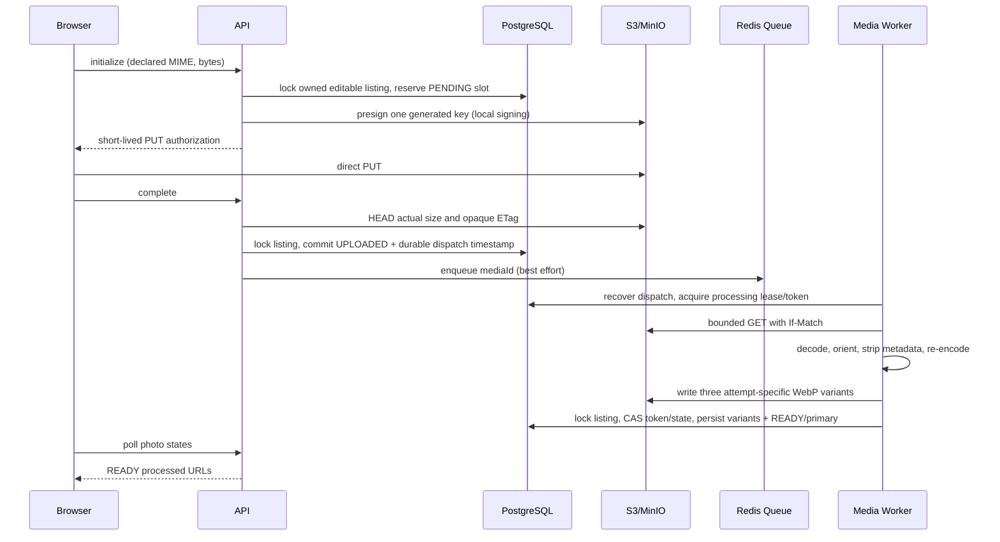
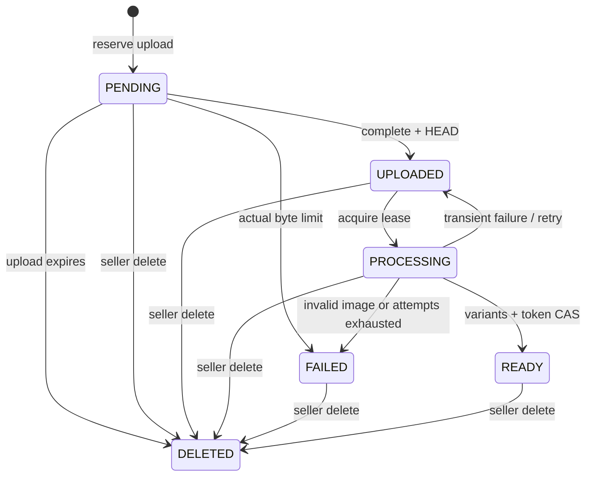

# Vehicle listing photos

## Shared marketplace support

Media remains attached to Listing.id for both VEHICLE and PART. No part_media or
second upload pipeline. Part forms and common owner detail reuse MediaEditor;
PART real MinIO/BullMQ worker/READY primary/submission without location is covered
by integration. Common ownership/Listing locks and state immutability apply to
both types. See [parts.md](parts.md).

## Overview

Media owns upload intents, processing state and immutable raster variants. PostgreSQL
is authoritative; BullMQ/Redis provides delivery, not the only record of work.
The API and media worker remain processes of the same modular monolith. Run a worker
alongside the API. No image decoding or large upload passes through an HTTP API request.

## Upload flow



PUT is portable across S3/R2-compatible providers. Signed Content-Type constrains
the request header, not file contents. Browser sets it and sends the file directly,
without Bearer/cookies. Filename is an optional bounded transport hint and is neither
stored nor used in object keys, audit or response headers. PUT cannot enforce a hard
pre-upload byte ceiling: declared bytes are checked first; HEAD and bounded GET check
actual bytes. Configure provider/account quotas as an additional infrastructure limit.
Upload URL lifetime defaults to 600 seconds (configuration bounds 60–900). Reusing an
authorization can overwrite only its private staging object until expiry; complete
pins the opaque ETag and GET uses If-Match. Changed/missing sources fail safely.

## Authorization

Every seller endpoint authenticates the current account/session, verifies listing
ownership and media/listing association. Foreign ownership returns LISTING_NOT_FOUND;
a mismatched media ID returns MEDIA_NOT_FOUND. ADMIN has no ownership bypass.
Mutation policy permits DRAFT and REJECTED only, including complete. Moderation,
PUBLISHED, SOLD and ARCHIVED photos are immutable for sellers. Mutations and READY
commit lock the same listing row as submit. Media endpoints serialize their own
operations; If-Match/version still protects core listing fields and seller lifecycle,
and is not a cache validator for volatile signed image URLs. All seller responses
are no-store. Upload reservations count against the limit, default 25; failed photos
count until deleted, expired reservations are released by cleanup. Initialization
has a separate 60/hour/actor rate policy, complete 60/minute/actor; ordinary read/write
policies are reused. Redis rate-limit failure returns safe 503.

## Object storage

Keep the bucket private and deny anonymous writes/reads. Local Compose explicitly
sets private bucket access and MinIO CORS to WEB_URL. Production deployment must
configure the provider's bucket CORS for that exact browser origin, PUT and
Content-Type, plus GET as needed. Do not expose storage administration credentials
to browsers; use a dedicated least-privilege API/worker storage identity in production.
The configured S3 endpoint must be browser-reachable (HTTPS in production); signing
an internal-only container hostname cannot support direct browser upload.

Keys are generated UUID paths:

```text
media/<mediaId>/source/<randomUUID>
media/<mediaId>/variants/<processingToken>/thumbnail.webp
media/<mediaId>/variants/<processingToken>/medium.webp
media/<mediaId>/variants/<processingToken>/large.webp
```

No raw filename, user path, arbitrary prefix or client-provided object key is accepted.
Originals are staging data: remove them after their PUT expiry plus 60-second clock
skew grace. Public clients never receive originals. Storage cost is three processed
objects per READY photo, plus temporary private sources and failed attempt objects.
READY keys never receive another processing write. Each retry has a new UUID token;
old attempts are reclaimed without changing retained READY objects.

## Media states



PENDING reuses the existing schema status; no competing media entity is introduced.
FAILED reason codes are INVALID_IMAGE, IMAGE_TOO_LARGE, UNSUPPORTED_IMAGE,
SOURCE_CHANGED, PROCESSING_FAILED and LEGACY_UNVALIDATED. Decoder/storage exceptions
are never returned. Permanent failures require deleting and uploading a replacement.

## Validation

JPEG, PNG and WebP only. SVG, GIF/animated/multipage, AVIF, video and documents are
not supported. MIME and extension cannot prove content: worker detects actual format
with sharp/libvips and decodes/re-encodes every output. A PNG named car.jpg is accepted;
HTML labelled JPEG is FAILED. Input defaults: 15 MiB, width/height ≤12,000 and ≤40 million
pixels. Config has hard safe bounds; source stream is bounded independently of HEAD.
Sharp failOn=warning, limitInputPixels, processing timeouts and no unlimited option
protect decoding, truncation and decompression resource use. Metadata must have valid
dimensions, allowed detected format and one page. Outputs are never source byte copies.

## Image processing

Sharp 0.35.4 is explicitly pinned for API runtime (already used by installed Next).
Its platform prebuilds are required; CI uses supported Node 24/Linux, local Windows
prebuilds are exercised. No custom binary image parser or image-processing HTTP
operation is used. WebP quality defaults to 82; thumbnail 320, medium 960 and large
1600 are maximum width **and height** boxes. Fit inside preserves ratio and
withoutEnlargement avoids upscaling. Per-variant processing timeout is 20 seconds.
Sharp concurrency is 1 native thread per operation, cache 32 MiB, files 0, items 32.

## EXIF/privacy

autoOrient applies EXIF rotation before resizing. Default sharp output strips EXIF,
GPS, camera/device metadata, XMP and orientation; withMetadata/keepMetadata is not used
for public output. Sources remain private even when they contain addresses or GPS.
Photos themselves may visually reveal personal details; automatic face/plate blurring
and AI moderation remain separate work. Re-encoding limited raster formats is the
current content boundary; antivirus infrastructure is not introduced.

## Queue

BullMQ 6.3.6 uses its documented node-redis adapter, reusing redis 5 already installed;
no second Redis driver is added. Queue name includes the configured database name,
so owned integration databases have distinct queues. Payload contains only mediaId.
MediaProcessingQueue isolates producer calls. Complete stores UPLOADED/dispatchAt
before best-effort enqueue. Worker scans at most 50 due rows every 3 seconds and
redispatches work every 30 seconds; this restores a lost enqueue or Redis queue loss.
Multiple dispatchers are safe because process-/cleanup-<UUID> job IDs are stable.

Processing claims persist a token, 180-second lease and attempts. Duplicate workers
cannot simultaneously claim a live lease. A restart/stall can be reclaimed after
expiry; final CAS requires PROCESSING plus the same token. A stale/deleted attempt
cannot publish variants. Four persisted attempts maximum survive Redis loss/repeated
delivery. BullMQ also uses four attempts with exponential 1/2/4-second backoff and one
allowed stall. Invalid content completes the job with FAILED, without transient retry.
Queue exceptions carry generic messages and no stack trace is persisted. Completed
jobs are removed; failed process jobs retain bounded history (one day/1,000 jobs).
Cleanup jobs have bounded retries per dispatch, then can be scheduled again.
Worker concurrency defaults 2, bounded 1–4. Shutdown stops dispatch, waits for current
jobs and closes worker/queue before platform resources close in application shutdown.

## Primary image

First READY result under the listing row lock becomes primary if absent. Selecting
primary clears the previous flag then sets the requested READY flag in one transaction.
Partial unique index guarantees at most one per listing; CHECK forbids non-READY primary.
Deleting primary chooses the first remaining READY by sortOrder/id. No READY photo means
no primary. Submission also checks that the READY primary has exactly three variants.

## Ordering

PUT order supplies every non-DELETED media ID exactly once. Foreign, duplicate or
missing IDs fail. Listing lock serializes initialization, deletion and reorder.
The partial unique position index applies only to active rows. Reorder first assigns
distinct temporary positions above current maximum, then writes 0..n-1; immediate
unique constraints therefore permit a real 0 ↔ 1 swap.

## Deletion

Transaction marks DELETED, removes primary and chooses replacement, records audit and
commits. Gallery excludes it immediately. S3 deletion follows asynchronously; no row
points to missing storage while remaining public. Worker final CAS cannot resurrect a
deleted row. Tombstones stay available for retry/reconciliation and daily revisits.
Objects written by an expired/stale processing attempt remain private and are reclaimed.
Deleting a missing S3 object is successful. There is no distributed S3/PG transaction.

## Cleanup

The worker dispatches cleanup queue jobs for expired PENDING, READY staging sources,
FAILED and DELETED objects. Stale UPLOADED/expired PROCESSING are redispatched for
bounded processing rather than silently deleted. Each operation lists only its generated
media prefix (bounded 10 pages of 1,000 keys), preserves current READY variant keys,
removes source/abandoned attempts and removes variant rows for non-READY tombstones.
Wait for upload expiry/lease plus grace to account for replay and late writes. Cleanup
is idempotent, retryable and revisits cleaned tombstones daily. Failed sources are
deleted after the same grace, while safe FAILED state remains visible to the seller.
`npm run media:cleanup` dispatches a bounded batch; a running worker executes it.
External schedulers may call this command; no distributed cron subsystem is needed.

## Public delivery

MediaReadService resolves private processed keys to short-lived presigned GET URLs
(600 seconds default), with image/webp, inline and private max-age=60. Providers and
credentials stay out of DTO fields. API list returns only primary thumbnail cover;
detail returns ordered READY gallery. Seller detail/media list shows active safe states
and READY variant URLs. Source keys, source URLs, upload authorizations, ETags, processing
tokens and EXIF never appear in listing DTOs. URL signing is local cryptography, not
an S3 HEAD per image. Media and variants are two batch queries independent of page size;
Unified Search cards use one eligibility/media projection SELECT. Parts add a fixed
bounded set of batch compatibility-reference queries whose count is independent of page
size. No gallery joins per card or N+1.
DTOs store no absolute URL in PostgreSQL. Delivery can later use a signed CDN adapter.
The UI uses unoptimized Next Image to avoid caching signed private URLs in the server
image optimizer. Seller polling is 5 seconds while pending, 4 minutes otherwise to
renew signed reads. Public users can refresh photos after expiry.

## Submission requirement

Submit now requires at least one READY primary with three variants. It also requires
unfinished PENDING/UPLOADED/PROCESSING uploads to finish or be deleted, keeping the
moderation photo set stable. Media checks and state change use the same listing row
lock as delete, so concurrent submit/delete cannot commit moderation with zero photos.
Core description/vehicle/location/price validation and If-Match remain in effect.

## HTTP API

All paths use `/api/v1`, Bearer authentication and current ownership:

| Method | Path                                            | Result                                         |
| ------ | ----------------------------------------------- | ---------------------------------------------- |
| GET    | /me/listings/:listingId/media                   | Safe active states and authoritative UI limits |
| POST   | /me/listings/:listingId/media/uploads           | One short-lived direct PUT authorization (201) |
| POST   | /me/listings/:listingId/media/:mediaId/complete | Idempotent HEAD/commit/enqueue (200)           |
| PUT    | /me/listings/:listingId/media/order             | Atomic full ordering                           |
| PUT    | /me/listings/:listingId/media/:mediaId/primary  | READY primary selection                        |
| DELETE | /me/listings/:listingId/media/:mediaId          | Logical deletion and replacement               |

Initialize body: contentType, sizeBytes, optional filename. Order: mediaIds array.
Other mutation bodies are empty objects. OpenAPI reflects schemas, statuses, limits
discovery, authorization and errors. Codes include MEDIA_LIMIT_EXCEEDED,
MEDIA_FILE_TOO_LARGE, MEDIA_OBJECT_NOT_FOUND, MEDIA_UPLOAD_EXPIRED, MEDIA_NOT_READY,
MEDIA_INVALID_IMAGE (empty source),
MEDIA_INVALID_ORDER, MEDIA_INVALID_STATE, MEDIA_NOT_FOUND, LISTING_MEDIA_LOCKED and
MEDIA_STORAGE_UNAVAILABLE. Invalid declarations/body fields use VALIDATION_ERROR;
invalid UUIDs use the existing BAD_REQUEST convention. Worker FAILED codes are not
raw HTTP decoder failures.

## Audit and observability

UPLOAD_INITIALIZED, READY, FAILED, REORDERED, PRIMARY_CHANGED and DELETED are prefixed
LISTING_MEDIA_. Audit stores media/listing operation target UUID and machine status/
reason only, never filename, URL, content or EXIF. Processing/cleanup logs include
mediaId, listingId, jobId, attempt, elapsed time, detected format and total output bytes
where applicable. HTTP request IDs are preserved for seller audit; worker job IDs
identify background work without inventing HTTP causation. No metrics backend exists;
structured events provide operational evidence without adding a metrics platform.

## Security considerations and known limitations

Tests exercise IDOR, mass assignment, generated paths, scoped signature tampering,
anonymous source denial, spoofed MIME, actual size, pixel limits, orientation/EXIF,
duplicate jobs/workers, primary uniqueness, ordering, retry, delete and submit races,
cleanup and lost dispatch with real isolated PG/Redis/MinIO. Small deterministic
fixtures are generated with sharp; no production credentials/cloud storage is used.
Frontend model/API/transport tests cover selection limits, progress/cancellation,
states restored by polling, accessible reorder and primary/delete transport. Browser
E2E/Playwright is not installed; native drag/drop and confirmation UI need browser E2E
coverage in a future testing task. No claim of browser E2E is made.

No AVIF/video, vendor CDN, image AI/moderation, watermarking, OCR, map/search, messaging
or approval workflow is added. No manual processing retry endpoint. Tombstones are
retained indefinitely pending a business retention policy; do not purge them before
all upload/worker late-write windows close. The cleanup pipeline must keep running.
Provider quotas, lifecycle rules for incomplete multipart/provider orphan uploads,
deployment resource limits and load tuning remain deployment responsibilities.
Worst-case decoded 40MP RGB/RGBA uses roughly 120–160 MiB per operation, plus native
buffers, source (15 MiB), outputs and cache; provision a worker memory budget with
headroom (e.g. ≥1 GiB for default concurrency 2), verify on real photos before tuning.

## Database

MediaWorkflow migration adds upload expiry, safe detected dimensions/format/bytes,
processed/failure state, private source ETag/processing token, lease/attempt/dispatch
metadata and the composite-PK variant table. Active-position partial index supports
tombstones. Existing unvalidated records become FAILED/LEGACY_UNVALIDATED and lose
primary, requiring re-upload: legacy READY labels alone do not prove safe variants.
Rollback drops workflow metadata/variants, removes tombstones and maps new transient/
failed states to the previous REJECTED state; processing metadata is not recoverable
by rollback. Test clean apply, media rollback/reapply and zero TypeORM diff.

Geo/Search now uses a targeted Media-owned READY-primary projection; only the thumbnail
is signed/returned and all three variants enforce the publication invariant. See
search-and-geo.md. Next work is the interactive map.
