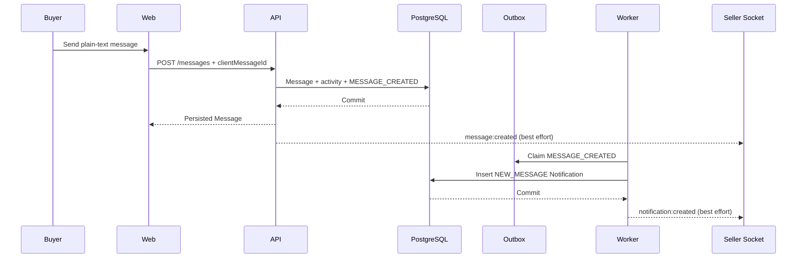
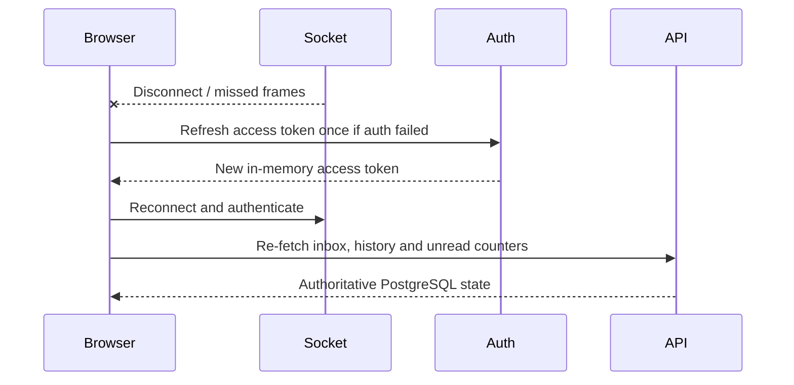

# Messaging and realtime

## Overview

Messaging is a module of the modular monolith. PostgreSQL owns conversations,
participants, messages, read watermarks and transactional outbox events. Socket.IO is
only a low-latency transport; losing Redis or a socket event cannot lose an accepted
message. Cars and Parts use the same Listing-based contract.

## Conversation identity

`(listing_id, buyer_id)` is unique. The seller is always read from `Listing.seller_id`;
clients never nominate a seller. Opening a PUBLISHED listing conversation is idempotent
and creates the buyer and seller participant rows in one transaction. Self-chat is
rejected. New conversations are unavailable for SOLD or ARCHIVED listings. Existing
participants retain history and may continue a short discussion for PUBLISHED, SOLD or
seller-archived listings. Internal moderation reasons are never projected.

## Lifecycle

Only a PUBLISHED Listing can start a conversation. SOLD and ARCHIVED Listings cannot
start new conversations; existing participants keep their history. Existing chats are
writable for PUBLISHED, SOLD and seller-archived states while both accounts remain
active. Moderator removal atomically makes its conversations read-only. A
missing/private listing is projected as an unavailable historical reference, and no
moderation reason is exposed.

## Persistence

`conversations` owns the Listing and buyer identity, `conversation_participants` owns
membership and read watermarks, and `messages` owns immutable sender/content/order data.
The sender-participant foreign key remains the final database membership guard.

## HTTP API

- `POST /api/v1/conversations` — `{listingId}`, open-or-return.
- `GET /api/v1/me/conversations?limit&cursor` — activity-ordered inbox.
- `GET /api/v1/me/conversations/unread-count` — global unread messages.
- `GET /api/v1/me/conversations/:id` — owner-scoped detail.
- `GET /api/v1/me/conversations/:id/messages?limit&cursor` — newest page returned
  chronologically; cursor requests older history.
- `POST /api/v1/me/conversations/:id/messages` — `{clientMessageId,body}`.
- `POST /api/v1/me/conversations/:id/read` — `{messageId}`.

Limits are 20 conversations, 30 messages by default, with maxima 50 and 100. Cursors
are signed, expiring, scope-bound and conversation-bound. Non-participants receive the
same 404 as an absent conversation. Inbox/detail include backend-authoritative
`canSend`; the composer must disable when it is false, while history remains readable.

## Idempotent send

The client creates a UUID `clientMessageId`. The unique key
`(conversation_id,sender_id,client_message_id)` makes concurrent retries safe. Reusing
the key with the same normalized body returns the original message. Reusing it with a
different body returns `409 MESSAGE_IDEMPOTENCY_CONFLICT`. Body text is NFC-normalized,
line endings are canonical, surrounding whitespace is removed and the configured code
point limit is bounded by the database limit of 8000. HTML is never interpreted.

HTTP and socket sends share the `messageSend` policy. Socket commands additionally
consume a per-user/per-conversation key, while subscription and read commands use
bounded read policies. Redis-backed limiting fails closed independently of the
best-effort realtime publisher.

## Message history

The initial cursor page selects the newest messages by `(created_at,id)` and returns
that bounded page in chronological order. Its signed, conversation-bound cursor loads
older messages. Message history never relies on socket event retention.

## Read state

Each participant stores `last_read_message_id` and `last_read_at`. The composite foreign
key proves that the pointer belongs to the same conversation. A tuple comparison on
`(created_at,id)` only advances the pointer, so delayed tabs cannot move it backwards.
Unread counts exclude the current user's messages and compare against that watermark.

## Unread counters

Inbox rows calculate per-conversation unread values inside the bounded projection query.
The global endpoint counts unread messages across memberships without loading history or
performing an exact conversation count. Realtime counters are hints and reconcile with
these HTTP results on connect and focus.

## Outbox

Message insertion, conversation activity update and `MESSAGE_CREATED` insertion happen
in one transaction. The engagement worker creates one `NEW_MESSAGE` notification for
each active recipient except the sender. The existing partial unique notification key
on `(user_id,source_event_id,type)` makes replay safe. The payload contains navigation
IDs and the sender's public display name; it deliberately excludes message body.

## Notifications

`NEW_MESSAGE` is one of the existing Notification Center types. The sender is excluded,
inactive recipients are excluded, and `(user_id,source_event_id,type)` deduplicates
worker replay. Its public payload contains navigation IDs and sender display name only.

## WebSocket

Socket.IO uses the `/realtime` namespace and WebSocket transport. The client supplies a
short-lived access token through `handshake.auth.accessToken`; URL query tokens are
rejected. The gateway verifies exact browser Origin, JWT claims and expiry, persisted
session state, current account status and roles. It revalidates every command and every
`REALTIME_REVALIDATE_SECONDS` while idle, and disconnects at access-token expiry.

Every authenticated socket joins `user:{userId}` and `session:{sessionId}`. A client may
join `conversation:{conversationId}` only after a database membership check. Room names
are server-created. Events are:

- `message:created`, `conversation:updated`, `conversation:read`;
- `notification:created`, `notification:read`, `notifications:read-all`.

Commands `conversation:subscribe`, `conversation:unsubscribe`, `message:send` and
`conversation:read` use `{ok,data}` / `{ok:false,error}` acknowledgements. HTTP and
socket sends call the same application command.

## Token expiration

The server schedules disconnect for JWT expiry and periodically revalidates the
persisted session, account status and current roles. It also revalidates every command.
A server-forced disconnect makes the frontend run the existing single-flight refresh
once and reconnect with the new in-memory token. A failed refresh or repeated auth
failure stops that recovery; ordinary network reconnects use Socket.IO's bounded
eight-attempt backoff.

## Redis

The official Socket.IO Redis adapter distributes room events between API instances;
the worker uses the Redis emitter. PostgreSQL commit is the durable success boundary.
Realtime publication happens afterward and is best effort. A Redis broadcast failure
is logged without coordinates, tokens or message bodies and never rolls back a Message.
Redis does not store chat history.

## Realtime guarantees

Message and Notification rows are durable; socket frames are best effort. Publication
always follows the transaction commit. A dropped, duplicated or reordered event is
recovered from HTTP and deduplicated by immutable message/notification IDs.

Notification producers use one `NotificationRealtime` boundary. Direct moderation and
account notifications publish only after their transaction commits. Saved-search,
favorite-status and new-message notifications publish after the engagement worker has
committed the durable Notification. Notification read changes are broadcast to the
user's other sockets.

## Send sequence

## Reconnect and reconciliation

The frontend owns one socket for the authenticated browser session and caps automatic
reconnect attempts. It refreshes the in-memory access token once after an authentication
failure. On connect, focus or route entry, inbox, history and counters are reloaded over
HTTP. Message IDs and `(senderId,clientMessageId)` suppress duplicate bubbles when an
HTTP response and realtime event race. Logout disconnects the shared socket.

## Frontend

`/account/messages` provides loading, error, empty, unread and cursor load-more states.
`/account/messages/[id]` supports older history, optimistic plain-text send, failed
retry with the same idempotency key, realtime updates, read advancement and reporting
through the existing Reports API. Vehicle and Part detail pages share the contact CTA;
it is hidden for the listing seller and requests login only after an explicit click.

## Index strategy and query plans

- `uq_conversations_listing_buyer`: open/dedupe under concurrency.
- `ix_conversation_participants_user_conversation`: inbox and global unread ownership.
- `ix_messages_conversation_cursor`: latest/older history and per-conversation unread.
- `uq_messages_sender_client`: retry lookup.
- existing `ix_notifications_user_unread` and event-recipient unique index: counters and
  durable notification replay.

`npm run messaging:plans` creates an owned test database with 10,000 users, 30,000
listings/conversations, 60,000 participants and 300,000 messages, runs `ANALYZE`, then
requires indexed plans for inbox, latest/older history, conversation/global unread,
conversation identity lookup and message retry dedupe. Reported timings are development
measurements, not a production SLA.

## Security

All HTTP and socket operations recheck current membership. Message body never enters
ordinary structured logs, audit metadata or `NEW_MESSAGE` payload. DTOs expose no email,
session, moderation or seller-private fields. Body/result/rate/page/socket buffer limits
bound abuse. Message reports use the existing participant and self-report rules.

## Privacy

Message bodies stay out of ordinary logs, audits and notification payloads. Public
participant projections contain only UUID and display name. Conversation projections
never expose email, roles, session state or internal moderation details.

## Deployment

The reverse proxy must forward `Connection: Upgrade` and `Upgrade: websocket` and allow
the configured secure WebSocket origin in CSP `connect-src`. The transport is
WebSocket-only, so the Redis adapter supports multi-instance fanout without HTTP
long-polling sticky sessions. If polling is enabled later, the load balancer must add
sticky sessions. A temporary realtime pub/sub outage is treated as degraded realtime;
durable HTTP history remains the recovery source. Existing Redis-backed rate-limit and
session policies retain their own readiness and failure behavior.

## Known limitations

Presence, typing indicators, attachments, message editing/deletion UI, push delivery,
email delivery and group chat are deferred. The Listing archive state does not retain
an actor; an independent `send_disabled_at` projection is set in the same transaction
as immutable moderator removal. Seller ARCHIVED conversations remain writable,
moderator-removed conversations return `canSend=false`, and history remains available.
Realtime is best effort by design.
