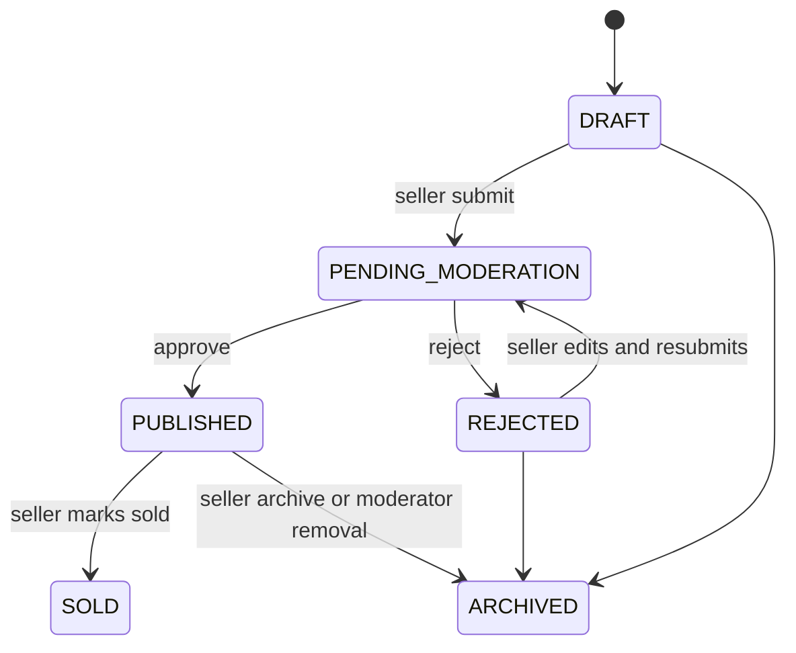
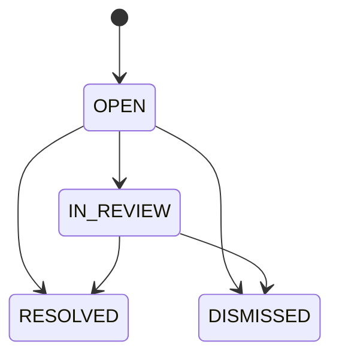

# Moderation and administration

## Overview

The `moderation` module owns listing decisions, user reports and immutable moderation history. The `admin` module owns account-status and role commands plus the privileged audit projection. They use exported application contracts from Listings, Users, Auth, Messaging, Notifications and Audit; neither module reaches another module's private repository.

PostgreSQL is authoritative. Listing decisions, report resolution, moderation history, audit entries and persisted notifications commit together. Redis is used only by request rate limiting. No external delivery runs in these transactions.

## Roles

| Capability                            | USER |      MODERATOR |          ADMIN |
| ------------------------------------- | ---: | -------------: | -------------: |
| Create an authenticated report        |  yes | with USER role | with USER role |
| Read listing/report moderation queues |   no |            yes |            yes |
| Approve, reject or remove a listing   |   no |            yes |            yes |
| Resolve or dismiss reports            |   no |            yes |            yes |
| List/manage users and roles           |   no |             no |            yes |
| Read security/admin audit             |   no |             no |            yes |

`RequireRoles` and the existing guards enforce HTTP access. Application services repeat the MODERATOR/ADMIN boundary before executing commands. Persisted roles and account status are read for every protected request, so role revocation and account suspension take effect without waiting for an access-token expiry.

## Listing moderation

`GET /api/v1/moderation/listings` returns the shared Cars/Parts queue. It is oldest-first by `(submittedAt, id)`, uses an opaque signed 24-hour cursor and supports `type`, exact `sellerId`, exact `listingId`, `submittedFrom`, `submittedTo` and `limit` (maximum 50). Queue cards contain one READY primary thumbnail and a short subtype summary. VIN and exact coordinates are absent.

`GET /api/v1/moderation/listings/:id` returns privileged detail, ETag/version, processed media statuses, subtype detail, seller summary and at most 50 immutable moderation actions. Vehicle VIN and exact coordinates are included because this workflow performs listing verification. The UI labels exact coordinates as private internal data.

Commands require the quoted ETag through `If-Match`:

- `POST .../:id/approve` with `{}`;
- `POST .../:id/reject` with `reasonCode`, seller-visible `sellerMessage` and optional `internalNote`;
- `POST .../:id/remove` with the same structured reason shape.

The seller-safe latest result is available to the owner at `GET /api/v1/me/listings/:id/moderation-result`. It contains reason code, seller message and timestamp. It never contains the moderator identity or internal note.

## State transitions



Moderator removal uses `ARCHIVED` plus an immutable `REMOVE_LISTING` action and `LISTING_REMOVED_BY_MODERATOR` audit event. The reason preserves the distinction from seller archive without adding another public lifecycle status. See ADR 0009.

## Approve transaction

```mermaid
sequenceDiagram
  actor Moderator
  participant API
  participant Service as ListingModerationService
  participant DB as PostgreSQL
  participant Audit
  Moderator->>API: approve + If-Match N
  API->>Service: typed principal, listing ID, N
  Service->>DB: lock listing; verify status/version/seller
  Service->>DB: recheck subtype, catalog, price, location and READY media
  Service->>DB: CAS PUBLISHED, publishedAt, version N+1
  Service->>DB: append ModerationAction + Notification
  Service->>Audit: append LISTING_APPROVED in same transaction
  DB-->>Service: commit
  Service-->>API: privileged detail + ETag N+1
```

Approval reruns the same publication policy used at seller submission. Both listing types require positive canonical price/currency, title, description and a READY primary image with all three processed variants and no unfinished upload. Cars additionally require valid Vehicle/catalog data and exact location. Parts require active category/brand, positive quantity and either UNIVERSAL mode or valid fitments. The seller must still be ACTIVE.

## Reports

`POST /api/v1/reports` requires an authenticated USER role and accepts a discriminated `LISTING`, `USER` or `MESSAGE` target. Reasons are `SCAM`, `SPAM`, `PROHIBITED_CONTENT`, `MISLEADING_INFORMATION`, `HARASSMENT`, `DUPLICATE`, `WRONG_CATEGORY` and `OTHER`, with a target/reason matrix. Optional details are bounded plain text.

Self-reports are rejected. A reporter can have only one `OPEN`/`IN_REVIEW` report for a target; three partial unique indexes make this protection race-safe while allowing a later incident after final resolution.



The shared queue is `GET /api/v1/moderation/reports`, oldest-first with status, target type and reason filters. Resolution is `POST .../:id/resolve` with final outcome, structured resolution and optional note. `CONTENT_REMOVED` is an explicit command: it requires the target listing version and atomically archives the published listing, records moderation/audit history and finalizes the report. Concurrent finalization is serialized and only one request succeeds.

## Message moderation privacy

A MESSAGE report is accepted only when the reporter belongs to the conversation and did not send the reported message. Privileged detail returns the reported message and at most two messages before and two after it. It never returns the whole conversation. Every such detail read appends `MODERATION_MESSAGE_CONTEXT_VIEWED`; audit metadata does not contain message text.

## User administration

ADMIN endpoints are under `/api/v1/admin`:

- `GET /users` — cursor pagination, exact status/role/user ID/email and created-date filters;
- `GET /users/:id` — safe profile, roles, active-session count, listing counts and recent safe audit records;
- `POST /users/:id/suspend`, `/block`, `/reactivate` — explicit commands with expected status, reason code and internal note;
- `PUT /users/:id/roles` — fixed-role replacement with expected-current roles;
- `GET /audit` — cursor pagination with actor, target, action and date filters.

Suspension is an administrative pause; blocking is the stronger account state. Both deny login/refresh/protected requests and revoke every DB session/token. Reactivation never restores old sessions. `PENDING_VERIFICATION` cannot be activated through these commands. Existing published listings remain published; content removal is a separate moderation decision, avoiding an unrecoverable implicit bulk archive.

## Roles administration

`USER` is mandatory. `MODERATOR` and `ADMIN` are additional fixed roles. Replacement is transactional and rejects stale `expectedRoles`. An administrator cannot remove their own ADMIN role. Every account-status and role mutation first takes the same PostgreSQL transaction advisory lock and only then locks user rows. This global lock order prevents cross-admin deadlocks and serializes the last-admin check; the last active ADMIN cannot be demoted, suspended or blocked.

Production ADMIN creation is an operational bootstrap, never public registration. Development may grant ADMIN to an existing verified account with `DEV_ADMIN_EMAIL=... npm run dev:grant-admin`; the command refuses non-development environments and records an audit event.

## Audit

Audit remains append-only. Moderation records `LISTING_APPROVED`, `LISTING_REJECTED`, `LISTING_REMOVED_BY_MODERATOR`, `REPORT_CREATED`, `REPORT_RESOLVED`, `REPORT_DISMISSED` and sensitive message-context reads. Admin records `USER_SUSPENDED`, `USER_BLOCKED`, `USER_REACTIVATED` and `USER_ROLES_CHANGED`.

The admin DTO exposes only action, actor/target IDs, request ID, timestamp and the existing allowlisted machine metadata fields. Passwords, cookies, authorization headers, token hashes, message bodies and arbitrary request bodies are neither written nor returned.

## Sensitive data

- Public/search/map DTOs remain unchanged and contain no moderation data, VIN or exact point.
- Queue DTOs omit VIN, exact point and internal notes.
- Privileged listing detail may expose VIN and exact point and is `no-store`.
- Seller result omits moderator identity and internal note.
- Report subjects never learn reporter identity through public/seller APIs.
- Message context is bounded to five messages and audited.

## Notifications

Approve, reject and moderator removal persist a `MODERATION_RESULT` notification in the same transaction. Account status commands persist `ACCOUNT_STATUS_CHANGED`. Payloads contain only machine state/reason, target ID and an optional seller-visible message. Email, push, WebSocket delivery and a notification centre are outside this stage.

## Concurrency

Listing commands lock the record, compare expected version and update through existing CAS. A stale moderator receives `MODERATION_VERSION_CONFLICT`; the UI reloads instead of replaying the command. Reports lock the report and update only an active status. Account commands require `expectedStatus`; role changes require `expectedRoles`. All account and role writes use one advisory lock before row locks, giving competing administrator operations a consistent lock order.

Privileged queues preserve PostgreSQL timestamp values to microsecond precision inside their signed cursors. Their keyset predicates therefore compare the same value used by PostgreSQL ordering, preventing duplicates when several rows share a JavaScript-millisecond timestamp.

## Search propagation

Approve changes status to `PUBLISHED`, so the existing Search/Map publication predicates include the listing immediately after commit. Reject remains private. Moderator removal changes status to `ARCHIVED`, so Search, list discovery and Map exclude it immediately. Search results are not cached, so no invalidation path is required.

## Query plans

Run `npm run moderation:plans` with isolated test infrastructure. It creates deterministic sets of 30,000 users, listings, reports and audit rows, runs `ANALYZE`, then executes `EXPLAIN (ANALYZE, BUFFERS, FORMAT JSON)` for:

| Query                          | Selected index                  | Rows | Development execution |
| ------------------------------ | ------------------------------- | ---: | --------------------: |
| Pending listing queue          | `ix_listings_moderation_queue`  |   20 |              0.034 ms |
| Open report queue              | `ix_reports_status_queue`       |   20 |              0.042 ms |
| Status-filtered user directory | `ix_users_admin_status_created` |   20 |              0.036 ms |
| Action-filtered audit timeline | `ix_audit_logs_action_created`  |   50 |              0.061 ms |

The measurements above are from the local run on 2026-09-21. The command fails if a required index is absent from the selected plan and prints fresh development execution times. These measurements are not production guarantees.

## Known limitations

- There is no moderator assignment, bulk action, AI scoring, automatic user punishment or live queue feed.
- Message moderation has no redaction command in this stage.
- Account suspension/block does not automatically archive already published listings.
- Notifications are persisted but not delivered.
- Audit retention and moderator workload analytics are operational follow-up work.
